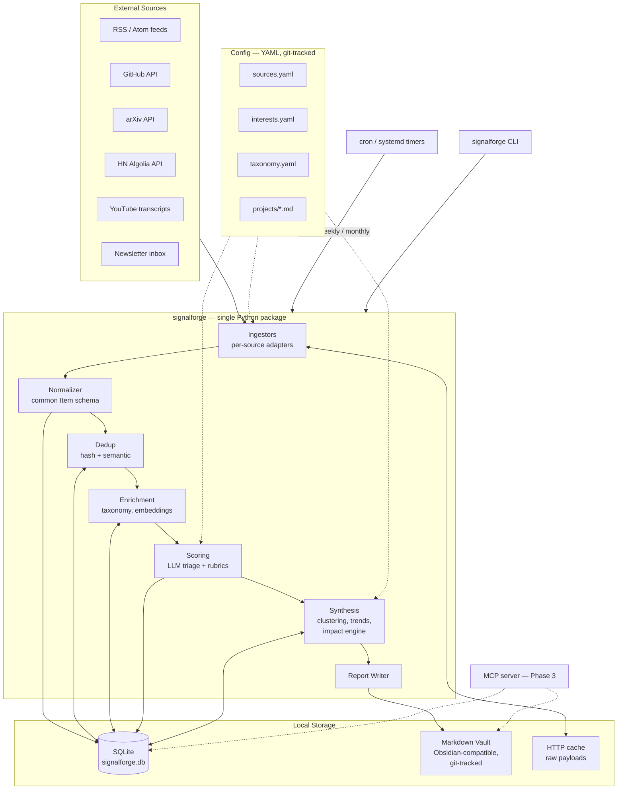
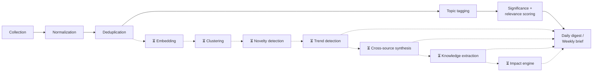

# SignalForge — Design Document

**An AI Engineering Intelligence Platform** — a Bloomberg Terminal for AI engineers, not a news aggregator.

| | |
|---|---|
| Status | Draft v1.0 — 2026-07-16 |
| Owner | James |
| Primary question | *"What genuinely changed in AI engineering that is worth my time?"* — answered weekly |
| Companion doc | Feasibility assessment & phased roadmap (`~/.claude/plans/assess-this-project-idea-velvety-papert.md`) |

---

## 1. Vision and Non-Goals

SignalForge continuously ingests from high-signal AI engineering sources, strips duplicates and hype, scores what remains against your interests and active projects, and produces daily/weekly/monthly intelligence reports in an Obsidian-compatible markdown vault.

**It answers "what changed that matters to me", not "what happened".** Every design decision below is subordinate to that: if a component doesn't make the weekly brief better, it doesn't get built.

### Non-goals (explicit)

- Not a public product. No auth, no multi-tenancy, no web UI in V1.
- Not real-time. Daily cadence for ingestion; weekly for synthesis. Nothing in AI engineering is so urgent it can't wait until tomorrow morning.
- Not exhaustive. Missing an item is acceptable; a noisy report is not. Precision over recall.
- Not autonomous (yet). Human-in-the-loop for all judgments; the system recommends, you decide.

### Design principles

1. **Deterministic by default, LLM by exception.** Fetching, parsing, dedup, storage, and scheduling are plain Python. LLMs are used only where judgment is required.
2. **Local-first.** SQLite + files on disk. No cloud dependency except the Anthropic API and the source APIs themselves.
3. **Markdown is the product.** The vault is the durable artifact; the database is regenerable plumbing.
4. **Sources are config, not code.** Adding a blog is a YAML edit.
5. **Failure isolation.** One broken source never kills a run. Every run produces a report from whatever succeeded.
6. **Idempotent runs.** Running the pipeline twice produces no duplicates and no double-spend.
7. **Monolith.** One Python package, one process, one database. Microservices are explicitly rejected — there is a single user and a daily batch cadence.

---

## 2. High-Level Architecture



Everything runs in one process invoked by cron (or manually via the CLI). The MCP server (Phase 3) is the only long-lived component, and even that is launched on demand by Claude Code.

---

## 3. Pipeline / Data Flow

The spec's 13-stage pipeline, mapped to phases. Stages marked ⏳ are deliberately deferred until the earlier stages prove their worth in the weekly report.



| Stage | Mechanism | Deterministic / LLM | Phase |
|---|---|---|---|
| Collection | Per-source adapters, HTTP with ETag/conditional GET | Deterministic | 0 |
| Normalization | Map every payload to one `Item` schema | Deterministic | 0 |
| Deduplication (exact) | Canonical-URL + content SHA-256 uniqueness in SQLite | Deterministic | 0 |
| Topic tagging | Keyword rules from `taxonomy.yaml`, LLM fallback for unmatched | Hybrid | 1 |
| Significance + relevance scoring | Batched LLM triage with rubric, on title/summary only | LLM | 0 (keep/kill), 1 (scores) |
| Embedding | Local model (sentence-transformers or Ollama) → `sqlite-vec` | Deterministic | 2 |
| Deduplication (semantic) | Cosine similarity > threshold within 14-day window | Deterministic | 2 |
| Clustering | Greedy agglomerative over the week's embeddings ("same story, N sources") | Deterministic | 2 |
| Novelty detection | Distance from historical corpus centroids + first-seen taxonomy terms | Deterministic, LLM annotates | 2 |
| Trend detection | Topic/entity frequency deltas week-over-week; LLM narrates | Hybrid | 2 |
| Cross-source synthesis | LLM over top clusters with citations | LLM | 2 |
| Knowledge extraction | LLM writes atomic insight notes into the vault | LLM | 3 |
| Architecture Impact Engine | LLM evaluates insights against `projects/*.md` | LLM | 3 |
| Report writing | Templates fill deterministically; LLM writes only the narrative sections | Hybrid | 0+ |

**The load-bearing cost decision:** scoring runs on *titles + summaries/abstracts* (cheap), and only the top-N survivors get full-content fetching and deep reading. This single choice keeps LLM spend an order of magnitude lower than naive full-content processing. The ceiling on "cheap" is `defaults.max_summary_chars` in `sources.yaml` (§7) — summaries are truncated to it at ingest, so it is the one knob that bounds triage spend.

---

## 4. Folder Structure

```
signalforge/
├── pyproject.toml              # uv-managed; Python 3.12+
├── README.md
├── docs/
│   └── DESIGN.md               # this document
├── config/
│   ├── sources.yaml            # what to ingest
│   ├── interests.yaml          # priorities, ignores, learning goals
│   ├── settings.yaml           # app & locale (timezone); optional, UTC default
│   ├── taxonomy.yaml           # topic tree + keyword rules
│   └── projects/               # Impact Engine context (Phase 3)
│       ├── fusedair.md
│       ├── hermes.md
│       └── trading-platform.md
├── src/signalforge/
│   ├── __init__.py
│   ├── cli.py                  # typer app: ingest | score | report | status | backfill
│   ├── config.py               # pydantic models for the YAML configs
│   ├── models.py               # Item, Score, Cluster, Insight (pydantic)
│   ├── db.py                   # SQLite connection, migrations, queries
│   ├── ingest/
│   │   ├── base.py             # Ingestor protocol + HTTP client (etag cache, retry)
│   │   ├── rss.py              # blogs, newsletters-with-feeds, Simon Willison et al.
│   │   ├── github.py           # releases, trending, awesome-list diffs
│   │   ├── arxiv.py            # category + keyword queries
│   │   ├── hackernews.py       # Algolia API, front page + keyword search
│   │   └── youtube.py          # Phase 3: yt-dlp auto-transcripts
│   ├── enrich/
│   │   ├── dedup.py            # exact (P0) + semantic (P2)
│   │   ├── taxonomy.py         # rule-based tagging, LLM fallback
│   │   ├── embed.py            # Phase 2: local embeddings + sqlite-vec
│   │   ├── cluster.py          # Phase 2
│   │   └── novelty.py          # Phase 2
│   ├── score/
│   │   ├── triage.py           # batched keep/kill (Haiku)
│   │   ├── rubrics.py          # scoring prompts as versioned constants
│   │   └── scorer.py           # 3-dimension scoring with reasoning
│   ├── synth/
│   │   ├── trends.py           # Phase 2
│   │   ├── synthesis.py        # Phase 2: cross-source narrative
│   │   └── impact.py           # Phase 3: Architecture Impact Engine
│   ├── report/
│   │   ├── templates/          # jinja2: daily.md.j2, weekly.md.j2, monthly.md.j2
│   │   └── writer.py           # fills templates, commits vault to git
│   ├── llm.py                  # single Anthropic client wrapper (caching, batching, budget)
│   └── mcp_server.py           # Phase 3: expose vault + DB to Claude Code
├── vault/                      # Obsidian vault — THE PRODUCT (own git repo or subdir)
│   ├── daily/2026-07-16.md
│   ├── weekly/2026-W29.md
│   ├── monthly/2026-07.md
│   ├── insights/               # Phase 3: atomic notes
│   ├── watchlists/             # repos.md, people.md
│   └── radar/                  # technology-radar.md, research-radar.md
├── data/
│   ├── signalforge.db          # SQLite (gitignored)
│   └── http_cache/             # raw responses (gitignored, pruned at 90 days)
└── tests/
```

**Module responsibilities are strict:** `ingest/` never calls an LLM; `score/` and `synth/` never make HTTP calls to sources; `report/` only reads the DB and writes markdown; `llm.py` is the *only* module that touches the Anthropic SDK, so budget accounting, prompt caching, and model selection live in exactly one place.

---

## 5. Database Schema

SQLite is the system of record for pipeline state; the vault is the system of record for knowledge. DuckDB is *not* used initially — SQLite handles this write pattern (small daily batches, single writer) better, and `sqlite-vec` covers vector search in Phase 2. DuckDB can be added later purely as an analytics layer reading the same file if trend queries get heavy.

```sql
PRAGMA journal_mode = WAL;

CREATE TABLE items (
    id            INTEGER PRIMARY KEY,
    source_id     TEXT NOT NULL,             -- key into sources.yaml
    source_type   TEXT NOT NULL,             -- rss | github | arxiv | hn | youtube | newsletter
    external_id   TEXT,                      -- guid / arxiv id / repo@tag / HN id
    url           TEXT NOT NULL,
    canonical_url TEXT NOT NULL,             -- tracking params stripped, host normalized
    title         TEXT NOT NULL,
    author        TEXT,
    published_at  TEXT,                      -- ISO 8601
    fetched_at    TEXT NOT NULL,
    summary       TEXT,                      -- feed summary / abstract / release notes
    content       TEXT,                      -- full text, fetched lazily for top-N only
    content_hash  TEXT NOT NULL,             -- sha256(title + summary)
    lang          TEXT DEFAULT 'en',
    raw_path      TEXT,                      -- pointer into data/http_cache/
    UNIQUE (canonical_url),
    UNIQUE (source_id, external_id)
);

CREATE TABLE scores (
    item_id        INTEGER PRIMARY KEY REFERENCES items(id),
    triage         TEXT NOT NULL,            -- keep | kill
    signal         INTEGER,                  -- 1-5: substance vs hype
    relevance      INTEGER,                  -- 1-5: against interests.yaml
    novelty        INTEGER,                  -- 1-5: new vs incremental
    reasoning      TEXT NOT NULL,            -- LLM's one-paragraph why (always stored)
    rubric_version TEXT NOT NULL,            -- ties score to the prompt that produced it
    model          TEXT NOT NULL,
    scored_at      TEXT NOT NULL
);

-- Phase 2
CREATE TABLE embeddings (                    -- paired with a sqlite-vec virtual table
    item_id    INTEGER PRIMARY KEY REFERENCES items(id),
    model      TEXT NOT NULL,
    vector     BLOB NOT NULL
);

CREATE TABLE clusters (
    id         INTEGER PRIMARY KEY,
    week       TEXT NOT NULL,                -- 2026-W29
    label      TEXT,                         -- LLM-written, e.g. "MCP sampling lands everywhere"
    summary    TEXT
);
CREATE TABLE cluster_members (
    cluster_id INTEGER REFERENCES clusters(id),
    item_id    INTEGER REFERENCES items(id),
    PRIMARY KEY (cluster_id, item_id)
);

CREATE TABLE trends (
    id         INTEGER PRIMARY KEY,
    week       TEXT NOT NULL,
    topic      TEXT NOT NULL,                -- taxonomy key or entity
    mentions   INTEGER NOT NULL,
    delta_pct  REAL,                         -- vs trailing 4-week mean
    direction  TEXT                          -- rising | falling | new | steady
);

-- Phase 3
CREATE TABLE insights (
    id          INTEGER PRIMARY KEY,
    week        TEXT NOT NULL,
    title       TEXT NOT NULL,
    body        TEXT NOT NULL,               -- also written to vault/insights/
    confidence  TEXT NOT NULL,               -- low | medium | high
    vault_path  TEXT NOT NULL
);
CREATE TABLE insight_citations (
    insight_id  INTEGER REFERENCES insights(id),
    item_id     INTEGER REFERENCES items(id),
    PRIMARY KEY (insight_id, item_id)
);
CREATE TABLE impact_assessments (
    id          INTEGER PRIMARY KEY,
    insight_id  INTEGER REFERENCES insights(id),
    project     TEXT NOT NULL,               -- fusedair | hermes | trading-platform | ai-platform
    verdict     TEXT NOT NULL,               -- ignore | watch | prototype | adopt
    reasoning   TEXT NOT NULL,
    created_at  TEXT NOT NULL
);

-- Operations
CREATE TABLE runs (
    id          INTEGER PRIMARY KEY,
    kind        TEXT NOT NULL,               -- ingest | score | daily | weekly | monthly
    started_at  TEXT NOT NULL,
    finished_at TEXT,
    status      TEXT,                        -- ok | partial | failed
    items_new   INTEGER DEFAULT 0,
    llm_input_tokens  INTEGER DEFAULT 0,
    llm_output_tokens INTEGER DEFAULT 0,
    errors      TEXT                         -- JSON list of per-source failures
);
CREATE TABLE feedback (                      -- human-in-the-loop signal for tuning
    item_id     INTEGER REFERENCES items(id),
    verdict     TEXT NOT NULL,               -- useful | noise | missed (added manually/via CLI)
    note        TEXT,
    created_at  TEXT NOT NULL,
    PRIMARY KEY (item_id, created_at)
);
```

Two details that pay for themselves later: **`rubric_version` on every score** (when you change a prompt, you know which scores are comparable), and **the `feedback` table** (a `signalforge mark <id> useful|noise` command builds the ground-truth set that V2 scoring tuning — and the V3 analyst — will need).

---

## 6. Knowledge Model

**Answer to "how should insights be stored": both markdown and SQLite, with a clear division.**

- **SQLite** holds pipeline state: items, scores, embeddings, clusters, run logs. Regenerable, gitignored, queryable.
- **The vault** holds knowledge: reports, atomic insight notes, watchlists, radars. Git-tracked, Obsidian-compatible, human-editable. If the DB burned down, the vault survives; if the vault burned down, the DB could largely regenerate it.

**Atomic notes (Phase 3), not a knowledge graph (ever, probably).** Each insight is one markdown file with frontmatter:

```markdown
---
title: MCP sampling shifts agent orchestration server-side
date: 2026-07-13
topics: [mcp, agent-planning]
confidence: medium
status: watch          # updated by hand or by the impact engine
sources:
  - https://github.com/modelcontextprotocol/...
  - https://simonwillison.net/...
---
One-paragraph claim. What changed, why it matters, what it displaces.

## Evidence
- [quote or fact + link]

## Relates to
[[2026-06-agent-memory-consolidation]]
```

Relationships are Obsidian wikilinks — free graph view, no graph database to maintain. Version history is git. Citations are mandatory: the report writer refuses to emit a claim without at least one `item.url` behind it, which is the structural defense against LLM confabulation in synthesis.

---

## 7. Ingestion Strategy

### Source coverage by phase

| Source | Method | Phase | Notes |
|---|---|---|---|
| Blogs / personal sites (Willison, Karpathy, Raschka, Chip Huyen, Hamel, swyx, Jason Liu, …) | RSS via `feedparser` | 0 | Nearly every listed thought leader has a feed |
| GitHub releases (aider, langgraph, mcp, ollama, vllm, litellm, claude-code, dspy, pydantic-ai, …) | REST `/releases`, `/tags` fallback | 0 | Auth token → 5k req/hr; release notes are the summary |
| Hacker News | Algolia API: front page ≥ N points + keyword queries | 0 | Free, no auth; comments fetched only for top items |
| Engineering newsletters (Latent Space, etc.) | RSS where published | 1 | Most have feeds; email fallback in Phase 3 |
| arXiv (cs.AI/CL/LG/SE + keyword filters: agents, context, retrieval, inference, evaluation, compression, fine-tuning) | arXiv API (Atom) | 1 | Politeness delay 3s; abstracts only at triage |
| Awesome lists (agent engineering, MCP, LLM, vector DBs, CLI tools) | Shallow `git clone` + diff of README between runs | 1 | New entries = new items; a diff, not a scrape |
| CHANGELOG.md on watched repos that don't cut GitHub releases | Same shallow-clone + diff mechanism as awesome lists | 2 | The Releases API misses repos that only append changelogs; doc repos (MCP spec, Anthropic docs) could ride the same mechanism if felt need appears |
| GitHub trending / star velocity | Search API `created:>date sort:stars` + star-count deltas on watched repos | 2 | Official API only — the trending page has none |
| GitHub issues/discussions on watched repos | REST, filtered to maintainer posts + high-reaction threads | 2 | High noise; gated behind Phase 2 relevance scoring |
| Reddit (r/LocalLLaMA, r/MachineLearning) | Public JSON endpoints, top-weekly only | 2 | Consensus summary, not individual opinions |
| YouTube (conference talks, engineering channels) | `yt-dlp` auto-captions for channels/playlists in sources.yaml | 3 | Transcript → LLM extracts claims + timestamps |
| Newsletters without feeds | Dedicated inbox (e.g. `signalforge@…`) polled via IMAP → parsed | 3 | |
| Podcasts | Only sources that publish transcripts | 3 | Local Whisper transcription deferred indefinitely |
| Conference material (NeurIPS/ICLR/ICML/AI Engineer Summit) | Covered indirectly via HN/blogs/arXiv; direct scraping deferred | — | |
| **X / Twitter** | **Cut** | — | API ~US$200/mo, scraping brittle/ToS-hostile; the listed people blog, and important threads reach HN in hours |
| Discord / Slack | Cut (revisit on felt need) | — | |
| Official docs (MCP spec, FastAPI, Anthropic, vLLM, …) | Not ingested — changelogs/releases already covered; docs are a *retrieval* target for the Phase 3 MCP server, not a feed | — | |

### `sources.yaml` shape

```yaml
defaults:
  fetch_timeout: 20
  min_hn_points: 80
  max_summary_chars: 4000   # triage cost ceiling — see §8
  max_item_age_days: 7      # ingest freshness window: first runs / new sources never backfill history

rss:
  - id: simonwillison
    url: https://simonwillison.net/atom/everything/
    weight: 1.3            # score multiplier: trusted author
  - id: interconnects
    url: https://www.interconnects.ai/feed

github:
  token_env: GITHUB_TOKEN
  releases: [Aider-AI/aider, langchain-ai/langgraph, modelcontextprotocol/specification,
             ollama/ollama, vllm-project/vllm, BerriAI/litellm, anthropics/claude-code,
             stanfordnlp/dspy, pydantic/pydantic-ai, ggml-org/llama.cpp, huggingface/transformers]
  awesome_lists: [e2b-dev/awesome-ai-agents, punkpeye/awesome-mcp-servers]

arxiv:
  categories: [cs.AI, cs.CL, cs.LG, cs.SE]
  require_keywords: [agent, context, retrieval, inference, evaluation,
                     fine-tuning, quantization, reasoning, embedding, tool use]

hackernews:
  keywords: [llm, claude, mcp, agent, rag, inference, ollama, vllm]
```

### Fetch mechanics (all sources)

- `httpx.AsyncClient`, per-source concurrency, global politeness limits.
- **Conditional GET** (ETag / If-Modified-Since) stored per source — most daily RSS fetches return 304 and cost nothing.
- Raw payloads archived to `data/http_cache/` (re-parse after bugs without re-fetching; pruned at 90 days).
- Per-source `try/except` with error capture into `runs.errors`; a source failing 3 consecutive runs surfaces a warning line in the next daily digest — the reports themselves are the monitoring channel.
- Retries via `tenacity` (exponential backoff, honors `Retry-After`).

---

## 8. Deterministic vs LLM Boundary

| Deterministic (plain Python) | LLM |
|---|---|
| All fetching, parsing, RSS/Atom handling | Triage keep/kill judgment |
| Normalization, canonical URLs, hashing | Significance/relevance/novelty scoring + written reasoning |
| Exact & semantic dedup, clustering math | Cluster labeling and cross-source synthesis |
| Scheduling, caching, retries, DB writes | Trend *narration* (the counting is deterministic) |
| Taxonomy keyword matching (first pass) | Taxonomy fallback for unmatched items |
| Embedding computation (local model) | Knowledge extraction (atomic notes) |
| Report template assembly, git commits | Architecture impact reasoning |
| Token/cost accounting | Report narrative sections only |

### LLM usage plan (via `llm.py`, the single chokepoint)

| Task | Model | Mechanism | Est. volume |
|---|---|---|---|
| Daily triage + 3-dim scoring | `claude-haiku-4-5` | **Batches API** (50% off), structured outputs (`messages.parse` with a pydantic `ScoredItem`), ~25 items per request | ~100–300 items/day, titles+summaries only |
| Deep-read of top-N (weekly) | `claude-haiku-4-5` | Full content, structured extraction | ~15–25 items/week |
| Weekly brief synthesis + impact engine | `claude-opus-4-8` | One streamed call; **prompt caching** on the stable rubric/interests/projects prefix (`cache_control: ephemeral`); adaptive thinking, `output_config: {effort: "high"}` | 1–2 calls/week |
| Monthly trend report | `claude-opus-4-8` | One call over pre-computed trend tables | 1 call/month |

Prompt-caching discipline (from day one, it's free to get right): system prompt = frozen rubric + `interests.yaml` + taxonomy, cache-controlled; the day's items go after the breakpoint. No timestamps or run IDs in the prefix.

**Cost estimate:** triage ≈ 150 items/day × ~700 tokens ≈ 3.2M input tokens/month on Haiku via Batches ≈ **~$1.60/mo**; weekly Opus synthesis ≈ 4 × (80k in / 8k out) ≈ **~$2.40/mo**; deep reads and monthly report ≈ ~$3/mo. **Total ≈ $5–10/month**, with $30 as the alarm threshold (the `runs` table tracks actual token spend; the weekly brief prints the month-to-date number).

---

## 9. Intelligence Scoring

**Three dimensions at launch, not eleven.** Each is 1–5 with a written rubric and mandatory reasoning. More dimensions are added only when you disagree with a ranking and can name the missing axis.

| Dimension | Rubric anchor points |
|---|---|
| **Signal vs hype** | 5 = working code/benchmarks/production report with numbers · 3 = credible announcement, substance thin · 1 = press release, "game-changer" language, no artifact |
| **Personal relevance** | 5 = directly touches priority topics or the current stack · 3 = adjacent, worth awareness · 1 = ignored topics or irrelevant domain |
| **Novelty** | 5 = new capability/approach not previously possible · 3 = meaningful increment on known approach · 1 = restatement of known material |

Weekly-brief inclusion: `signal ≥ 3 AND relevance ≥ 3 AND (signal + relevance + novelty) ≥ 10`, then ranked. Thresholds live in `interests.yaml`, not code.

**Deferred dimensions and where their intent lands instead:** practicality/implementation-effort/production-readiness → folded into the impact engine verdict reasoning (Phase 3); engineering maturity → repo watchlist metadata; long-term impact → monthly trend report; risk/confidence → confidence field on insight notes. The spec's full list is a menu for V2+, not a launch requirement — 11 numbers from an LLM is pseudo-precision that erodes trust in all of them.

---

## 10. Topic Taxonomy

Data, not code — `taxonomy.yaml`, two levels deep, each topic carrying match keywords for the deterministic first-pass tagger:

```yaml
agents:
  planning:   {keywords: [planning, orchestration, multi-agent, subagent]}
  memory:     {keywords: [agent memory, episodic, memory store]}
  mcp:        {keywords: [mcp, model context protocol]}
  evaluation: {keywords: [eval, benchmark, agent eval]}
models:
  inference:      {keywords: [vllm, throughput, kv cache, speculative, batching]}
  local:          {keywords: [ollama, llama.cpp, gguf, on-device]}
  optimization:   {keywords: [quantization, distillation, pruning, lora]}
  fine-tuning:    {keywords: [fine-tun, rlhf, dpo, sft]}
  reasoning:      {keywords: [reasoning, chain of thought, thinking]}
retrieval:
  rag:        {keywords: [rag, retrieval-augmented]}
  embeddings: {keywords: [embedding, reranker]}
  vector:     {keywords: [vector search, hnsw, sqlite-vec, pgvector]}
engineering:
  context:       {keywords: [context engineering, prompt caching, compaction]}
  prompting:     {keywords: [prompt engineering, system prompt]}
  code-gen:      {keywords: [code generation, coding agent, claude code, aider, cline]}
  testing:       {keywords: [llm testing, eval harness]}
  observability: {keywords: [tracing, telemetry, langfuse]}
  security:      {keywords: [prompt injection, jailbreak, sandbox]}
infra:
  gpu:        {keywords: [gpu, cuda, h100]}
  cpu:        {keywords: [cpu inference, avx]}
  databases:  {keywords: [duckdb, sqlite, postgres]}
  workflow:   {keywords: [workflow engine, temporal, dag]}
  distributed:{keywords: [distributed, sharding]}
tooling:
  cli: {keywords: [cli, terminal, tui]}
```

Tagging: lowercase keyword match first (free, covers ~80%); unmatched items get topics assigned in the same Haiku triage call (marginal cost ~zero). New leaf topics are a YAML edit; the tagger warns on taxonomy keys that haven't matched anything in 60 days.

---

## 11. Personalization

`interests.yaml` — the knobs the spec asks for, all in one reviewable file:

```yaml
priority_topics: [agents.mcp, engineering.code-gen, engineering.context, models.local, retrieval.rag]
interests: [python, fastapi, sqlite, duckdb, claude-code, trading-systems, local-first]
stack: [python, typescript, fastapi, sqlite, postgres, docker, wsl]
learning_goals: [agent memory architectures, production llm evaluation]
architecture_philosophy: >
  Local-first, deterministic pipelines, low operational cost, monolith-by-default,
  boring technology, human-in-the-loop.
ignore:
  topics: [crypto, web3, model-release-hype]
  people: []
  repos: []
thresholds:
  {weekly_min_signal: 3, weekly_min_relevance: 3, weekly_min_total: 10, daily_max_items: 15,
   daily_max_per_source: 2, daily_max_per_github_repo: 1}
```

This file is injected (cached) into every scoring and synthesis prompt. It is the single place where "relevant to me" is defined — tuning the system means editing this file and marking items `useful`/`noise` via the CLI, never editing prompts.

### Closing the feedback loop (capture: Phase 1 · adaptation: Phase 2)

The `feedback` table (§5) is the sensor; this is the servo. Design constraint up front: **never per-mark reactive** — a single thumbs-down changes nothing except a stored row. Adaptation is batch, aggregated, capped, and *proposed rather than auto-applied*.

**Capture (Phase 1).** `signalforge mark <id> useful|noise|missed` (+ optional note). `missed` — "this should have been surfaced" — is the highest-value verdict; the weekly brief footer lists near-miss items (scored just below threshold) to make it easy to give. Friction decides whether this gets 20 marks a month or 2, and reading happens in Obsidian while `mark` lives in a terminal — so the digest/brief templates render a mark affordance per item (checkbox or `#useful`/`#noise` tag line), and the next run **harvests marks from the vault file before regenerating it** (the writer already overwrites reports idempotently; harvest-then-overwrite keeps that). CLI and vault marks land in the same `feedback` table.

**Adaptation (Phase 2), monthly, alongside the monthly report:**

1. **Aggregate with shrinkage.** Per-source and per-topic useful/noise ratios, smoothed toward neutral with a Beta prior — one mark barely moves the estimate; a consistent pattern over weeks does. Deterministic SQL + arithmetic; zero LLM cost.
2. **Propose capped nudges, human applies.** The monthly report emits a *proposed tuning* block — e.g. "`cloudflare-ai`: 9 useful / 1 noise → weight 1.0 → 1.1" or "`models.local`: 0 useful / 8 noise over 2 months → candidate for `ignore.topics`". Weight nudges capped at ±0.1/month. Applying = a YAML edit (or `signalforge tune --apply`), so every dial-shift is a reviewable git diff on `sources.yaml`/`interests.yaml` — config stays data, and a bad month can't silently rewire the feed.
3. **Feedback exemplars in the scoring prompt** (the LLM lever). A small rotating set (~10) of the most informative marks — prioritizing *disagreements* ("scored 4/5, marked noise") — is injected into the scoring prompt so Haiku learns taste from examples, not adjectives. Two standing rules make this safe: exemplars live in the prompt-cached prefix, so they rotate at most monthly (never per-run — NEVER 10), and each rotation is a prompt change, so it **bumps `rubric_version`** (NEVER 5), keeping score comparability explicit.

Phase 1's acceptance metric (≥ 80% of brief items rated `useful`) doubles as the health check for this loop: if the ratio drifts down and the proposed-tuning blocks aren't fixing it, the rubric — not the weights — is what needs attention.

---

## 12. Architecture Impact Engine (Phase 3 — highest-value component)

Each active project gets a context document, e.g. `config/projects/hermes.md`:

```markdown
---
name: Hermes
status: active
stack: [python, fastapi, sqlite]
---
## What it is
[2-3 paragraphs: purpose, users, constraints]
## Current architecture
[key decisions and why]
## Open problems
[the things you'd pay to solve — this section drives most Prototype/Adopt hits]
## Explicitly not doing
[rejected approaches, so the engine stops re-suggesting them]
```

Weekly, after synthesis, the top insights + all project docs go to `claude-opus-4-8` in one cached-prefix call. Output per (insight × relevant project):

> **Verdict:** Ignore | Watch | Prototype | Adopt
> **Reasoning:** why, referencing the project's stack, open problems, and philosophy
> **If Prototype:** the smallest experiment that would validate it (≤ 1 day of effort)

Rendered as a per-project section in the weekly brief and appended to `impact_assessments` so verdict history is queryable ("what have we been told to Watch for 3+ weeks?" → promotion candidates). Verdicts are recommendations — the human promotes Watch→Prototype, never the system. This component is deliberately cheap: it is prompt engineering over infrastructure Phases 0–2 already built, which is why it can be this late in the roadmap without risk.

---

## 13. Reports

All reports land in the vault, git-committed, with frontmatter for Obsidian queries. Templates are jinja2; the LLM writes only clearly-marked narrative blocks.

| Report | Cadence / trigger | Contents | Phase |
|---|---|---|---|
| **Daily Digest** | cron 06:00 | Top `daily_max_items` (default 15) kept items after crowding limits (below): title, one-line why-it-matters, scores, link. 60-second read. Footer: yesterday's source failures + items killed count + kept items not shown. Frontmatter: `item_count` = rendered, `kept_count` = all kept (semantics split when the cap landed; older digests predate `kept_count`) | 0 |
| **Weekly Intelligence Brief** | Sunday 07:00 | *The product.* Lead: "The 3 things that mattered." Then clustered top items with synthesis + citations, impact-engine verdicts per project (P3), trend deltas (P2), watchlist changes, cost/ops footer | 1 |
| **Monthly Trend Report** | 1st of month | Rising/falling topics vs 3-month baseline, new entrants, cluster arcs, "boring but steady" section | 2 |
| **Technology Radar** | Monthly, regenerated | Adopt/Trial/Assess/Hold per tool, derived from impact verdict history | 3 |
| **Research Radar** | Monthly | arXiv themes gaining implementation traction (paper → repo appearances) | 3 |
| **Watchlists (repos, people)** | Continuous, updated weekly | Per-repo: release cadence, star velocity, notable issues. Per-person: recent output + hit rate | 2 |
| **Projects Worth Building / Ideas Worth Ignoring** | Section in monthly report | Gaps the trend data exposes; hype the data deflated | 2–3 |
| **Quarterly Architecture Review** | Manual ritual | *Not generated.* You, the vault, and an afternoon. The system's job is making that afternoon possible | — |

### Crowding limits (Phase 0)

Rank alone lets *volume* beat *merit*. Score is per-item, so a source that
emits N items about one thing gets N shots at the top of the ranking: a
release watch that backfills four versions of a library, or a link blog that
posts five times, sweeps the digest while genuinely different items sit just
under the cap. The first digests to hit this spent 8 of 15 slots that way.

Two limits therefore run over the ranked kept items *before* `daily_max_items`
(all deterministic Python — §8; nothing here is a judgment call):

| Knob | Rule |
|---|---|
| `daily_max_per_source` | At most N items from any one `sources.yaml` source. |
| `daily_max_per_github_repo` | A tighter cap for release watches — for a `github` source, `source_id` *is* the repo, so this needs no URL parsing or version comparison. Where both apply, the tighter wins. |

Two properties they must keep:

- **Best, not newest.** Each limit keeps the top-*ranked* slice within its
  group. Recency is the tempting rule and it is wrong: prereleases publish
  *after* the stable release they follow, so "newest wins" hands the slot to
  `dspy 3.3.0b1` and evicts the `3.2.0` that actually scored. The ranking
  already encodes which item is worth reading.
- **Filter, never reorder.** The rendered list stays a sub-sequence of the
  ranking, so the digest remains a pure function of `(date, db state, config)`
  and re-renders byte-identically (principle 6). Crowded-out items are still
  counted in the footer's not-shown total — they are hidden, never silently
  dropped.

These bound *presentation*, not relevance: a crowded-out item is still kept,
still scored, still eligible for the weekly brief. They are also not a
substitute for the ingest-side freshness window (`max_item_age_days`), which
is what stops a newly-added source backfilling its history into one digest.

---

## 14. Scheduling & Operations

- **cron (or systemd timers) on WSL/Linux** — no scheduler daemon, no Airflow. Entries: `signalforge daily` (ingest→score→digest, 06:00), `signalforge weekly` (Sun 07:00), `signalforge monthly` (1st, 08:00).
- Every command is **idempotent**: re-running today's digest overwrites today's file; ingest upserts on the unique keys; scoring skips already-scored items. A missed run self-heals on the next one (ingestors look back 7 days, not 1).
- `signalforge status` prints last-run health, per-source freshness, and month-to-date token spend.
- **Docker** is provided as an optional `Dockerfile` + compose file for portability, but the default deployment is a `uv`-managed venv + crontab — one fewer layer between you and the logs.
- Backups: the vault is git (push to a private remote); `signalforge.db` gets a nightly `sqlite3 .backup` copy; both configs are in the repo.
- **Out-of-repo vault (`settings.yaml` `vault_dir`).** The output directory is configurable (e.g. a `/mnt/c` Windows Obsidian vault read from a WSL pipeline). When `vault_dir` points outside the repo, the vault has its own git story: the Phase 1 auto-commit in `report/writer.py` must target *that* directory's repo (or no-op cleanly when it isn't a repo), and the backup line above rides on the vault's actual location, not this repo. Decide this when `writer.py` is specced — it does not exist yet.

---

## 15. Technology Recommendations

| Concern | Choice | Rejected alternatives & why |
|---|---|---|
| Language / runtime | Python 3.12+, `uv` | — |
| HTTP | `httpx` (async) + `tenacity` | `requests` (no async) |
| Feeds | `feedparser` | custom parsing |
| Content extraction | `trafilatura` (top-N deep reads only) | readability-lxml (weaker) |
| Config/validation | `pydantic` v2 + `pydantic-settings` | — |
| DB | `sqlite3` stdlib + thin `db.py`; **no ORM** | SQLAlchemy (abstraction tax for ~12 tables); DuckDB (wrong write pattern; add later for analytics if needed); Postgres (deferred until a real multi-writer need exists) |
| Vectors (P2) | `sentence-transformers` (bge-small / all-MiniLM) or Ollama embeddings + `sqlite-vec` | chromadb/qdrant (a server for a problem SQLite solves at this scale) |
| LLM | `anthropic` SDK: `claude-haiku-4-5` (triage, Batches API) + `claude-opus-4-8` (synthesis); structured outputs via `messages.parse`; prompt caching throughout | LangChain/LangGraph (the pipeline is deterministic Python; an orchestration framework adds surface, not capability) |
| CLI | `typer` + `rich` | — |
| Templates | `jinja2` | — |
| Transcripts (P3) | `yt-dlp` auto-captions | Whisper (cost/time; only if caption quality proves inadequate) |
| MCP (P3) | `mcp` Python SDK (or FastMCP), stdio transport | — |
| FastAPI | **Deferred** — terminal-first means no server until a real HTTP consumer exists. First legitimate uses: webhook receivers or a read-only vault browser, both V2+ | |
| Tests | `pytest` + recorded HTTP fixtures (`respx`); golden-file tests for normalizer and report templates | |

---

## 16. Roadmap

### Phase 0 — Prove the loop (1–2 weekends) → *MVP seed*
RSS + GitHub releases + HN → normalize → exact dedup → batched Haiku triage → daily digest in the vault, via cron.
**Status — built, gate not yet met** (progress log: [`CHANGELOG.md`](../CHANGELOG.md)):
- [x] Ingest (RSS + GitHub releases + HN) → SQLite, per-source isolation, conditional GET
- [x] Normalize + exact dedup, idempotent upserts
- [x] Batched Haiku triage + 3-dimension scoring on titles + summaries only
- [x] Daily digest → vault, with per-source / per-repo crowding limits
- [x] Timezone-aware day boundary (UTC storage, configurable reader locale)
- [x] Cron installed (06:00 daily via crontab; digests land in the configured `vault_dir`)
- [ ] Read 5 mornings straight and it saved time
- [ ] Live double-run = zero duplicates (run `signalforge daily` twice back-to-back: second run must add 0 rows, spend 0 tokens, and re-render the digest byte-identically)

**Acceptance:** you read it 5 mornings straight and it saved time; a double-run produces zero duplicates. If the digest isn't worth reading, fix that before adding anything.
**Local-day boundary (resolved).** Storage and every timestamp are UTC; the reader-facing calendar day is resolved through one configurable IANA timezone in `config/settings.yaml` (`SettingsConfig`, defaulting to `UTC` — §4, config not code). The daily digest computes "today" as `datetime.now(tz).date()`, and `report/daily.py::utc_day_window` converts that local date to the half-open UTC range `[local-midnight, next-local-midnight)` actually queried against `scored_at` (built from the two adjacent local midnights, so a DST-shortened/lengthened day stays exactly one calendar day). This is what lets a `score` and a `digest` run that straddle UTC midnight still agree on which day the work belongs to — the failure mode that gave a UTC+10 operator an empty digest while the items hid under the prior UTC date. `settings.yaml` is its own file because a timezone is neither a relevance rule (`interests.yaml`) nor a source (`sources.yaml`): it is who and where the operator is, and it is the seam that makes the tool portable to any locale. Scope is deliberately narrow: only the reader-facing digest day is localized. The `status` command's month-to-date token bucket (the $30 alarm) stays UTC — durations and freshness are timezone-invariant, and only the cost-month's first/last day would differ; keeping ops in UTC avoids a second, subtly different notion of "month" for a marginal readout.

### Phase 1 — MVP: the weekly question (4–6 more weekends)
**Status — not started** (gated on Phase 0's acceptance).
`sources.yaml` / `interests.yaml` / `taxonomy.yaml`; arXiv + awesome-list diffing; 3-dimension scoring with stored reasoning; **Weekly Intelligence Brief**; vault git-committed; `status` + `mark` commands.
**Acceptance:** four consecutive Sunday briefs that answer the primary question; ≥ 80% of brief items rated `useful`.

### Phase 2 — Intelligence layer (months 3–5) → *V2*
**Status — not started.**
Local embeddings + `sqlite-vec`; semantic dedup + weekly clustering; **signal strength** — the count of distinct independent sources corroborating a cluster within a time window, a deterministic ranking input alongside the three LLM dimensions (one blog post is weak; the same idea in a release + a blog + a paper + an HN thread the same week is strong); novelty-by-distance; trend detection + monthly report, including per-source yield stats (items kept / promoted / marked useful per source — the pruning data for risk 6); watchlists; GitHub star-velocity + issues; Reddit weekly consensus; **feedback adaptation** — monthly shrinkage-smoothed useful/noise stats per source/topic, proposed capped tuning nudges in the monthly report, and rotating feedback exemplars in the scoring prompt (§11 "Closing the feedback loop").
**Gate:** only starts once Phase 1 briefs are being read every week.

### Phase 3 — Decision support (months 5–9) → *V2 complete*
**Status — not started.**
Architecture Impact Engine (`projects/*.md`, Ignore/Watch/Prototype/Adopt); knowledge extraction into atomic insight notes; **MCP server** exposing search over items/insights/verdicts to Claude Code; YouTube transcripts; newsletter inbox; radars.

### V3 vision — Research Analyst (month 9+, only if V2 has earned it)
The stretch goal, decomposed into stepwise-verifiable capabilities rather than "an autonomous analyst":
1. **Pattern memory** — insights + trend history + verdict history give the synthesis call longitudinal context ("this is the 4th memory-consolidation approach this quarter; the previous three stalled").
2. **Prediction with receipts** — monthly, the system makes explicit 6–12-month calls ("MCP-native agent frameworks displace bespoke orchestration") with confidence + falsification criteria, logged and **scored against outcomes** — the `feedback` and trend tables make it accountable, which is what separates an analyst from a horoscope.
3. **Experiment recommendation** — extends impact-engine Prototype verdicts into ranked experiment briefs (hypothesis, smallest test, effort, which project benefits).
4. Humans still make every final judgment. The system's ambition ceiling is *better questions and receipts*, not decisions.

---

## 17. Risks

| # | Risk | L | I | Mitigation |
|---|---|---|---|---|
| 1 | **Pipeline becomes the hobby; reports unread** | High | Fatal | Phase 0 acceptance test; each phase gated on the previous one being *used*; features must map to a felt gap in a real report |
| 2 | Scraper rot / API drift | High | Med | Official APIs + RSS only; per-source isolation; raw-payload cache; failures surface in the digest itself |
| 3 | Scoring distrust (scores feel arbitrary) | Med | High | Written reasoning stored with every score; `rubric_version`; `mark useful/noise` feedback loop; 3 dimensions not 11 |
| 4 | LLM cost creep | Med | Med | Triage on summaries only; Batches API; prompt caching; per-run token accounting with monthly alarm in the brief |
| 5 | Synthesis confabulation | Med | High | Citation-required rendering (no claim without an item URL); synthesis operates only over stored items, never open-ended |
| 6 | Source list goes stale | Med | Med | Watchlist hit-rate stats; quarterly `sources.yaml` review prompted by the monthly report |
| 7 | X/Twitter blind spot | High | Low | Accepted: thought leaders' blogs + HN mirror the signal within hours-to-days; daily cadence makes the lag irrelevant |
| 8 | Life intervenes; project pauses | Med | Low | Idempotent, self-healing runs; a paused system resumes with `cron` re-enabled; no daemon state to rot |

---

## 18. Future Extensions (beyond V3)

- **Postgres migration** — only if a second writer or remote access appears; the `db.py` chokepoint keeps SQL portable.
- **FastAPI read layer** — a small read-only API/HTML view over the vault for phone reading.
- **Push channel** — weekly brief to email/Telegram; the vault stays canonical.
- **Discord/Slack ingestion** — if a specific community proves consistently high-signal.
- **Cross-user sharing** — publishing the sanitized weekly brief; explicitly out of scope until the personal loop is mature.

---

## Appendix A — What the spec asked for vs where it landed

| Spec ask | Disposition |
|---|---|
| 13-stage pipeline | All stages present; §3 maps each to phase + mechanism |
| 11 scoring dimensions | 3 at launch (§9); remainder folded into impact engine / watchlists / trend report with rationale |
| 12 source types | 8 ingested across phases; X/Twitter, Discord/Slack, podcasts-needing-transcription, direct conference scraping cut with reasons (§7) |
| Knowledge model options | SQLite for state + markdown atomic notes for knowledge; wikilinks over graph DB (§6) |
| 12 report types | 8 generated + quarterly review kept deliberately manual (§13) |
| Deterministic vs LLM split | §8, enforced structurally by module boundaries |
| Autonomous analyst stretch goal | Decomposed into 3 accountable capabilities with a falsification loop (§16 V3) |
