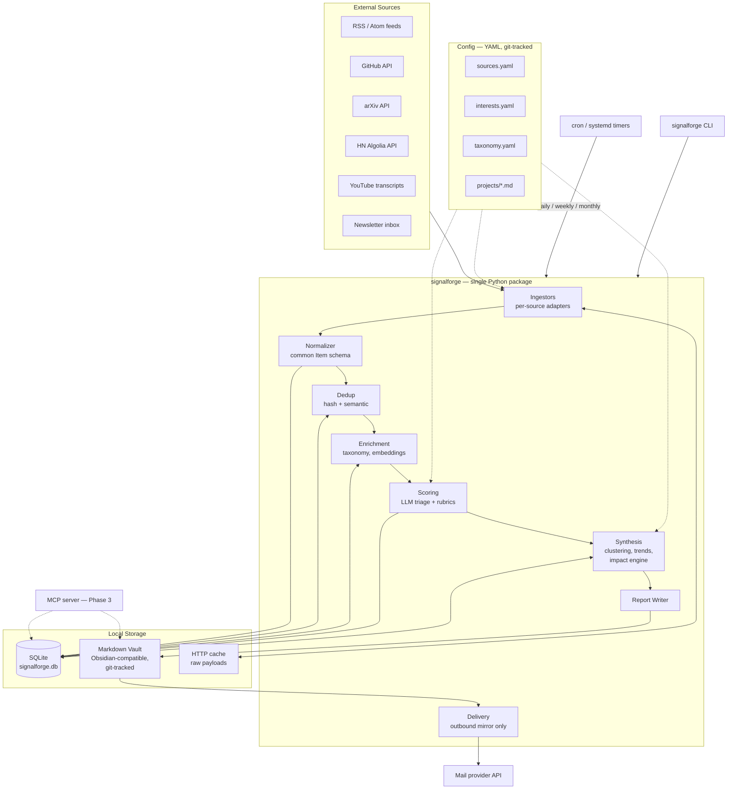
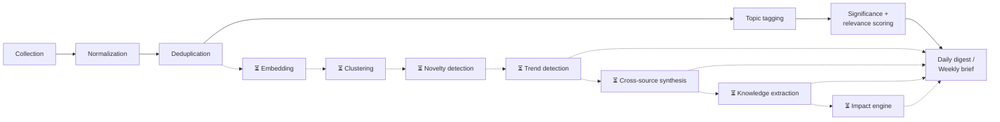

# SignalForge — Design Document

**An AI Engineering Intelligence Platform** — a Bloomberg Terminal for AI engineers, not a news aggregator.

| | |
|---|---|
| Status | Draft v1.0 — 2026-07-16 |
| Owner | James |
| Primary question | *"What genuinely changed in AI engineering that is worth my time?"* — answered weekly |
| Companion doc | Feasibility assessment & phased roadmap (`~/.claude/plans/assess-this-project-idea-velvety-papert.md`) |

---

## 1. Vision and Non-Goals

SignalForge continuously ingests from high-signal AI engineering sources, strips duplicates and hype, scores what remains against your interests and active projects, and produces daily/weekly/monthly intelligence reports in an Obsidian-compatible markdown vault.

**It answers "what changed that matters to me", not "what happened".** Every design decision below is subordinate to that: if a component doesn't make the weekly brief better, it doesn't get built.

### Non-goals (explicit)

- Not a public product. No auth, no multi-tenancy, no web UI in V1.
- Not real-time. Daily cadence for ingestion; weekly for synthesis. Nothing in AI engineering is so urgent it can't wait until tomorrow morning.
- Not exhaustive. Missing an item is acceptable; a noisy report is not. Precision over recall.
- Not autonomous (yet). Human-in-the-loop for all judgments; the system recommends, you decide.

### Design principles

1. **Deterministic by default, LLM by exception.** Fetching, parsing, dedup, storage, and scheduling are plain Python. LLMs are used only where judgment is required.
2. **Local-first.** SQLite + files on disk. No cloud dependency except the Anthropic API and the source APIs themselves.
3. **Markdown is the product.** The vault is the durable artifact; the database is regenerable plumbing.
4. **Sources are config, not code.** Adding a blog is a YAML edit.
5. **Failure isolation.** One broken source never kills a run. Every run produces a report from whatever succeeded.
6. **Idempotent runs.** Running the pipeline twice produces no duplicates and no double-spend.
7. **Monolith.** One Python package, one process, one database. Microservices are explicitly rejected — there is a single user and a daily batch cadence.

---

## 2. High-Level Architecture


```mermaid
flowchart TB
    subgraph sources [External Sources]
        RSS[RSS / Atom feeds]
        GH[GitHub API]
        AX[arXiv API]
        HN[HN Algolia API]
        YT[YouTube transcripts]
        NL[Newsletter inbox]
    end

    subgraph core [signalforge — single Python package]
        ING[Ingestors<br/>per-source adapters]
        NORM[Normalizer<br/>common Item schema]
        DEDUP[Dedup<br/>hash + semantic]
        ENR[Enrichment<br/>taxonomy, embeddings]
        SCORE[Scoring<br/>LLM triage + rubrics]
        SYNTH[Synthesis<br/>clustering, trends,<br/>impact engine]
        REP[Report Writer]
        DEL[Delivery<br/>outbound mirror only]
    end

    subgraph storage [Local Storage]
        DB[(SQLite<br/>signalforge.db)]
        VAULT[Markdown Vault<br/>Obsidian-compatible,<br/>git-tracked]
        CACHE[HTTP cache<br/>raw payloads]
    end

    subgraph config [Config — YAML, git-tracked]
        SRC[sources.yaml]
        INT[interests.yaml]
        TAX[taxonomy.yaml]
        PRJ[projects/*.md]
    end

    sources --> ING --> NORM --> DEDUP --> ENR --> SCORE --> SYNTH --> REP
    ING <--> CACHE
    NORM --> DB
    DEDUP <--> DB
    ENR <--> DB
    SCORE --> DB
    SYNTH <--> DB
    REP --> VAULT
    VAULT --> DEL --> MAIL[Mail provider API]
    config -.-> ING & SCORE & SYNTH

    CRON[cron / systemd timers] -->|daily / weekly / monthly| core
    CLI[signalforge CLI] --> core
    MCP[MCP server — Phase 3] -.-> DB & VAULT
```

Everything runs in one process invoked by cron (or manually via the CLI). The MCP server (Phase 3) is the only long-lived component, and even that is launched on demand by Claude Code.

---

## 3. Pipeline / Data Flow

The spec's 13-stage pipeline, mapped to phases. Stages marked ⏳ are deliberately deferred until the earlier stages prove their worth in the weekly report.


```mermaid
flowchart LR
    A[Collection] --> B[Normalization] --> C[Deduplication] --> D[Topic tagging] --> S[Significance +<br/>relevance scoring] --> R[Daily digest /<br/>Weekly brief]
    C -.-> E[⏳ Embedding] -.-> F[⏳ Clustering] -.-> G[⏳ Novelty detection] -.-> T[⏳ Trend detection] -.-> X[⏳ Cross-source synthesis] -.-> K[⏳ Knowledge extraction] -.-> I[⏳ Impact engine]
    T & X & K & I -.-> R
```

| Stage | Mechanism | Deterministic / LLM | Phase |
|---|---|---|---|
| Collection | Per-source adapters, HTTP with ETag/conditional GET | Deterministic | 0 |
| Normalization | Map every payload to one `Item` schema | Deterministic | 0 |
| Deduplication (exact) | Canonical-URL + content SHA-256 uniqueness in SQLite | Deterministic | 0 |
| Topic tagging | Keyword rules from `taxonomy.yaml`, LLM fallback for unmatched | Hybrid | 1 |
| Significance + relevance scoring | Batched LLM triage with rubric, on title/summary only | LLM | 0 (keep/kill), 1 (scores) |
| Embedding | Local model (sentence-transformers or Ollama) → `sqlite-vec` | Deterministic | 2 |
| Deduplication (semantic) | Cosine similarity > threshold within 14-day window | Deterministic | 2 |
| Clustering | Greedy agglomerative over the week's embeddings ("same story, N sources") | Deterministic | 2 |
| Novelty detection | Distance from historical corpus centroids + first-seen taxonomy terms | Deterministic, LLM annotates | 2 |
| Trend detection | Topic/entity frequency deltas week-over-week; LLM narrates | Hybrid | 2 |
| Cross-source synthesis | LLM over top clusters with citations | LLM | 2 |
| Knowledge extraction | LLM writes atomic insight notes into the vault | LLM | 3 |
| Architecture Impact Engine | LLM evaluates insights against `projects/*.md` | LLM | 3 |
| Report writing | Templates fill deterministically; LLM writes only the narrative sections | Hybrid | 0+ |

**The load-bearing cost decision:** scoring runs on *titles + summaries/abstracts* (cheap), and only the top-N survivors get full-content fetching and deep reading. This single choice keeps LLM spend an order of magnitude lower than naive full-content processing. The ceiling on "cheap" is `defaults.max_summary_chars` in `sources.yaml` (§7) — summaries are truncated to it at ingest, so it is the one knob that bounds triage spend.

---

## 4. Folder Structure

```
signalforge/
├── pyproject.toml              # uv-managed; Python 3.12+
├── README.md
├── docs/
│   └── DESIGN.md               # this document
├── config/
│   ├── sources.yaml            # what to ingest
│   ├── interests.yaml          # priorities, ignores, learning goals
│   ├── settings.yaml           # app & locale (timezone); optional, UTC default
│   ├── taxonomy.yaml           # topic tree + keyword rules
│   └── projects/               # Impact Engine context (Phase 3)
│       ├── fusedair.md
│       ├── hermes.md
│       └── trading-platform.md
├── src/signalforge/
│   ├── __init__.py
│   ├── cli.py                  # typer app: ingest | score | digest | podcast | daily | mark | curate | deliver | status
│   ├── config.py               # pydantic models for the YAML configs
│   ├── models.py               # Item, Score, Cluster, Insight (pydantic)
│   ├── db.py                   # SQLite connection, migrations, queries
│   ├── ingest/
│   │   ├── base.py             # Ingestor protocol + HTTP client (etag cache, retry)
│   │   ├── rss.py              # blogs, newsletters-with-feeds, Simon Willison et al.
│   │   ├── github.py           # releases, trending, awesome-list diffs
│   │   ├── arxiv.py            # category + keyword queries
│   │   ├── hackernews.py       # Algolia API, front page + keyword search
│   │   ├── probe.py            # feed/repo health facts for curation (§7.1); writes no items
│   │   ├── fullcontent.py      # deep-read: full article text for the podcast's top-N (§13.3)
│   │   └── youtube.py          # Phase 3: yt-dlp auto-transcripts
│   ├── curate/                 # Phase 1: adaptive source curation (§7.1)
│   │   ├── gather.py           # per-source yield + outbound attention (DB reads only)
│   │   ├── scout.py            # the weekly LLM judgment call
│   │   ├── probe.py            # drives ingest/probe.py over candidates
│   │   ├── approvals.py        # digest tick-box wire format + vault harvest (read-only)
│   │   └── apply.py            # append-and-comment-out applier for sources.yaml
│   ├── enrich/
│   │   ├── dedup.py            # exact (P0) + semantic (P2)
│   │   ├── taxonomy.py         # rule-based tagging, LLM fallback
│   │   ├── embed.py            # Phase 2: local embeddings + sqlite-vec
│   │   ├── cluster.py          # Phase 2
│   │   └── novelty.py          # Phase 2
│   ├── score/
│   │   ├── triage.py           # batched keep/kill (Haiku)
│   │   ├── rubrics.py          # scoring prompts as versioned constants
│   │   └── scorer.py           # 3-dimension scoring with reasoning
│   ├── synth/
│   │   ├── podcast.py          # daily two-presenter script, via llm.py only (§13.3)
│   │   ├── weekly.py           # the Sunday brief's one Opus call, via llm.py only (§13)
│   │   ├── trends.py           # Phase 2
│   │   ├── synthesis.py        # Phase 2: cross-source narrative
│   │   └── impact.py           # Phase 3: Architecture Impact Engine
│   ├── report/
│   │   ├── templates/          # jinja2: daily.md.j2, podcast.md.j2, weekly.md.j2, monthly.md.j2
│   │   ├── daily.py            # fills the daily digest template
│   │   ├── podcast.py          # fills/parses the podcast script template (§13.3)
│   │   └── weekly.py           # selects the week's items, then fills the brief template
│   ├── deliver/                # §13.2: outbound mirrors of an already-written report
│   │   ├── templates/          # jinja2: email_daily.html.j2, email_daily.txt.j2, podcast_feed.xml.j2
│   │   ├── email.py            # renders + POSTs to a mail provider API
│   │   ├── tts.py              # podcast: OpenRouter TTS synthesis + spend accounting (§13.3)
│   │   ├── storage.py          # podcast: hand-rolled SigV4 PUT/DELETE/LIST against R2 (§13.3)
│   │   └── podcast.py          # podcast: synthesize, upload, rebuild feed.xml, prune (§13.3)
│   ├── feedback.py             # harvests item marks back out of vault markdown (§11)
│   ├── llm.py                  # single Anthropic client wrapper (caching, batching, budget)
│   └── mcp_server.py           # Phase 3: expose vault + DB to Claude Code
├── vault/                      # Obsidian vault — THE PRODUCT (own git repo or subdir)
│   ├── daily/2026-07-16.md
│   ├── podcast/2026-08-07.md   # episode script, source of truth for TTS (§13.3)
│   ├── weekly/2026-08-09.md        # dated by the Sunday it is published on
│   ├── monthly/2026-07.md
│   ├── insights/               # Phase 3: atomic notes
│   ├── watchlists/             # repos.md, people.md
│   └── radar/                  # technology-radar.md, research-radar.md
├── data/
│   ├── signalforge.db          # SQLite (gitignored)
│   ├── http_cache/             # raw responses (gitignored, pruned at 90 days)
│   └── audio/                  # local mp3 cache, gitignored, NOT backed up (§13.3)
└── tests/
```

**Module responsibilities are strict:** `ingest/` never calls an LLM; `score/` and `synth/` never make HTTP calls to sources; `report/` only reads the DB and writes markdown; `llm.py` is the *only* module that touches the Anthropic SDK, so budget accounting, prompt caching, and model selection live in exactly one place. `deliver/` makes HTTP calls but only *outbound*, mirroring a report `report/` has already written; it never queries items, never writes to the vault, and is never an input surface — see §13.2. The single sanctioned exception is `curate/`, which calls both `llm.py` and `ingest/probe.py` in that fixed order and writes no `items` row — see §7.1.

---

## 5. Database Schema

SQLite is the system of record for pipeline state; the vault is the system of record for knowledge. DuckDB is *not* used initially — SQLite handles this write pattern (small daily batches, single writer) better, and `sqlite-vec` covers vector search in Phase 2. DuckDB can be added later purely as an analytics layer reading the same file if trend queries get heavy.

```sql
PRAGMA journal_mode = WAL;

CREATE TABLE items (
    id            INTEGER PRIMARY KEY,
    source_id     TEXT NOT NULL,             -- key into sources.yaml
    source_type   TEXT NOT NULL,             -- rss | github | arxiv | hn | youtube | newsletter
    external_id   TEXT,                      -- guid / arxiv id / repo@tag / HN id
    url           TEXT NOT NULL,
    canonical_url TEXT NOT NULL,             -- tracking params stripped, host normalized
    title         TEXT NOT NULL,
    author        TEXT,
    published_at  TEXT,                      -- ISO 8601
    fetched_at    TEXT NOT NULL,
    summary       TEXT,                      -- feed summary / abstract / release notes
    content       TEXT,                      -- full text, fetched lazily for top-N only
    content_hash  TEXT NOT NULL,             -- sha256(title + summary)
    lang          TEXT DEFAULT 'en',
    raw_path      TEXT,                      -- pointer into data/http_cache/
    UNIQUE (canonical_url),
    UNIQUE (source_id, external_id)
);

CREATE TABLE scores (
    item_id        INTEGER PRIMARY KEY REFERENCES items(id),
    triage         TEXT NOT NULL,            -- keep | kill
    signal         INTEGER,                  -- 1-5: substance vs hype
    relevance      INTEGER,                  -- 1-5: against interests.yaml
    novelty        INTEGER,                  -- 1-5: new vs incremental
    reasoning      TEXT NOT NULL,            -- LLM's one-paragraph why (always stored)
    rubric_version TEXT NOT NULL,            -- ties score to the prompt that produced it
    model          TEXT NOT NULL,
    scored_at      TEXT NOT NULL
);

CREATE TABLE item_topics (                   -- deterministic keyword tagger's output (§10)
    item_id          INTEGER NOT NULL REFERENCES items(id),
    topic            TEXT NOT NULL,          -- "group.leaf" from taxonomy.yaml
    matched_keyword  TEXT NOT NULL,          -- which keyword fired: the evidence for a taxonomy edit
    taxonomy_version TEXT NOT NULL,          -- ties a tag to the vocabulary that produced it
    tagged_at        TEXT NOT NULL,
    UNIQUE (item_id, topic)                  -- the idempotency lever; a version bump updates, not duplicates
);

-- Phase 2
CREATE TABLE embeddings (                    -- paired with a sqlite-vec virtual table
    item_id    INTEGER PRIMARY KEY REFERENCES items(id),
    model      TEXT NOT NULL,
    vector     BLOB NOT NULL
);

CREATE TABLE clusters (
    id         INTEGER PRIMARY KEY,
    week       TEXT NOT NULL,                -- 2026-W29
    label      TEXT,                         -- LLM-written, e.g. "MCP sampling lands everywhere"
    summary    TEXT
);
CREATE TABLE cluster_members (
    cluster_id INTEGER REFERENCES clusters(id),
    item_id    INTEGER REFERENCES items(id),
    PRIMARY KEY (cluster_id, item_id)
);

CREATE TABLE trends (
    id         INTEGER PRIMARY KEY,
    week       TEXT NOT NULL,
    topic      TEXT NOT NULL,                -- taxonomy key or entity
    mentions   INTEGER NOT NULL,
    delta_pct  REAL,                         -- vs trailing 4-week mean
    direction  TEXT                          -- rising | falling | new | steady
);

-- Phase 3
CREATE TABLE insights (
    id          INTEGER PRIMARY KEY,
    week        TEXT NOT NULL,
    title       TEXT NOT NULL,
    body        TEXT NOT NULL,               -- also written to vault/insights/
    confidence  TEXT NOT NULL,               -- low | medium | high
    vault_path  TEXT NOT NULL
);
CREATE TABLE insight_citations (
    insight_id  INTEGER REFERENCES insights(id),
    item_id     INTEGER REFERENCES items(id),
    PRIMARY KEY (insight_id, item_id)
);
CREATE TABLE impact_assessments (
    id          INTEGER PRIMARY KEY,
    insight_id  INTEGER REFERENCES insights(id),
    project     TEXT NOT NULL,               -- fusedair | hermes | trading-platform | ai-platform
    verdict     TEXT NOT NULL,               -- ignore | watch | prototype | adopt
    reasoning   TEXT NOT NULL,
    created_at  TEXT NOT NULL
);

-- Operations
CREATE TABLE runs (
    id          INTEGER PRIMARY KEY,
    kind        TEXT NOT NULL,               -- ingest | score | curate | curate-apply | daily | podcast | weekly | monthly
    started_at  TEXT NOT NULL,
    finished_at TEXT,
    status      TEXT,                        -- ok | partial | failed
    items_new   INTEGER DEFAULT 0,
    llm_input_tokens  INTEGER DEFAULT 0,
    llm_output_tokens INTEGER DEFAULT 0,
    server_tool_requests INTEGER DEFAULT 0,  -- billed per call, not per token (web search) — §7.1
    tts_characters INTEGER DEFAULT 0,        -- podcast TTS spend, priced by deliver/tts.py (§13.3)
    errors      TEXT                         -- JSON list of per-source failures
);
CREATE TABLE feedback (                      -- human-in-the-loop signal for tuning
    item_id     INTEGER REFERENCES items(id),
    verdict     TEXT NOT NULL,               -- noise < useful < exceptional (ordinal) | missed (off-ladder)
    note        TEXT,
    created_at  TEXT NOT NULL,
    PRIMARY KEY (item_id, created_at)
);

CREATE TABLE proposals (                     -- proposed sources.yaml changes, awaiting a human tick (§7.1)
    id            INTEGER PRIMARY KEY,
    run_id        INTEGER REFERENCES runs(id),
    kind          TEXT NOT NULL,             -- add_rss | retire_rss | add_github_repo | retire_github_repo
                                             -- | add_hn_keyword | remove_hn_keyword
                                             -- | add_arxiv_keyword | remove_arxiv_keyword
    dedup_key     TEXT NOT NULL,             -- normalized target: canonical_url | owner/repo | keyword
    payload       TEXT NOT NULL,             -- JSON: url, suggested weight, source id, …
    rationale     TEXT NOT NULL,             -- the scout's why
    evidence      TEXT NOT NULL,             -- JSON [{url, note}] — non-empty by construction (§5 citations)
    probe         TEXT,                      -- JSON deterministic health facts; NULL for non-fetchable kinds
    tier          TEXT NOT NULL,             -- corpus | web — where the candidate came from
    status        TEXT NOT NULL,             -- pending | approved | rejected | applied | invalid
                                             -- only pending/invalid are insertable; the rest are
                                             -- guarded transitions, so nothing can skip the human gate
    surface_date  TEXT NOT NULL,             -- the digest date this first renders on
    created_at    TEXT NOT NULL,
    decided_at    TEXT,
    decision_note TEXT,                      -- the operator's reason, when given (CLI only — a
                                             -- checkbox carries no text); replayed to the scout
    applied_at    TEXT
);
CREATE UNIQUE INDEX ux_proposals_kind_key ON proposals (kind, dedup_key);

CREATE TABLE deliveries (                    -- one row per report handed to an outbound channel (§13.2)
    id          INTEGER PRIMARY KEY,
    run_id      INTEGER REFERENCES runs(id),
    channel     TEXT NOT NULL,               -- email | podcast
    report_kind TEXT NOT NULL,               -- daily | podcast
    target_date TEXT NOT NULL,               -- the report's date, not the send time
    body_hash   TEXT NOT NULL,               -- sha256 of what went out; audit trail only, never
                                             -- part of the key — a re-render is the same report
    provider_id TEXT,                        -- the provider's message id, when it gives one
    sent_at     TEXT NOT NULL
);
CREATE UNIQUE INDEX ux_deliveries_channel_kind_date ON deliveries (channel, report_kind, target_date);
```

Four details that pay for themselves later: **`rubric_version` on every score** (when you change a prompt, you know which scores are comparable), **the `feedback` table** (a `signalforge mark <id> useful|noise` command builds the ground-truth set that V2 scoring tuning — and the V3 analyst — will need), **`ux_proposals_kind_key`** (one row per distinct proposal ever, so re-running the scout is a no-op and a rejected proposal never comes back — the same trick `ux_feedback_item_verdict` plays for marks), and **`ux_deliveries_channel_kind_date`** (one send per report per channel ever, so re-rendering a digest mails nothing). That last one is the only idempotency lever here with a *stateless* partner — `deliver.MAX_DELIVERY_AGE_DAYS` — because this table lives in a database §14 says you may delete and rebuild.

---

## 6. Knowledge Model

**Answer to "how should insights be stored": both markdown and SQLite, with a clear division.**

- **SQLite** holds pipeline state: items, scores, embeddings, clusters, run logs. Regenerable, gitignored, queryable.
- **The vault** holds knowledge: reports, atomic insight notes, watchlists, radars. Git-tracked, Obsidian-compatible, human-editable. If the DB burned down, the vault survives; if the vault burned down, the DB could largely regenerate it.

**Atomic notes (Phase 3), not a knowledge graph (ever, probably).** Each insight is one markdown file with frontmatter:

```markdown
---
title: MCP sampling shifts agent orchestration server-side
date: 2026-07-13
topics: [mcp, agent-planning]
confidence: medium
status: watch          # updated by hand or by the impact engine
sources:
  - https://github.com/modelcontextprotocol/...
  - https://simonwillison.net/...
---
One-paragraph claim. What changed, why it matters, what it displaces.

## Evidence
- [quote or fact + link]

## Relates to
[[2026-06-agent-memory-consolidation]]
```

Relationships are Obsidian wikilinks — free graph view, no graph database to maintain. Version history is git. Citations are mandatory: the report writer refuses to emit a claim without at least one `item.url` behind it, which is the structural defense against LLM confabulation in synthesis.

---

## 7. Ingestion Strategy

### Source coverage by phase

| Source | Method | Phase | Notes |
|---|---|---|---|
| Blogs / personal sites (Willison, Karpathy, Raschka, Chip Huyen, Hamel, swyx, Jason Liu, …) | RSS via `feedparser` | 0 | Nearly every listed thought leader has a feed |
| GitHub releases (aider, langgraph, mcp, ollama, vllm, litellm, claude-code, dspy, pydantic-ai, …) | REST `/releases`, `/tags` fallback | 0 | Auth token → 5k req/hr; release notes are the summary |
| Hacker News | Algolia API: front page ≥ N points + keyword queries | 0 | Free, no auth; comments fetched only for top items |
| Engineering newsletters (Latent Space, etc.) | RSS where published | 1 | Most have feeds; email fallback in Phase 3 |
| arXiv (cs.AI/CL/LG/SE + keyword filters: agents, context, retrieval, inference, evaluation, compression, fine-tuning) | arXiv API (Atom), `ingest/arxiv.py`, **live 2026-08-07** | 1 | Categories + keywords fold into one `search_query` per run, so the 3s politeness guidance is satisfied by never issuing a second request rather than by a coded delay; abstracts only at triage |
| Awesome lists (agent engineering, MCP, LLM, vector DBs, CLI tools) | Shallow `git clone` + diff of README between runs | 1 | New entries = new items; a diff, not a scrape |
| CHANGELOG.md on watched repos that don't cut GitHub releases | Same shallow-clone + diff mechanism as awesome lists | 2 | The Releases API misses repos that only append changelogs; doc repos (MCP spec, Anthropic docs) could ride the same mechanism if felt need appears |
| GitHub trending / star velocity | Search API `created:>date sort:stars` + star-count deltas on watched repos | 2 | Official API only — the trending page has none |
| GitHub issues/discussions on watched repos | REST, filtered to maintainer posts + high-reaction threads | 2 | High noise; gated behind Phase 2 relevance scoring |
| Reddit (r/LocalLLaMA, r/MachineLearning) | Public JSON endpoints, top-weekly only | 2 | Consensus summary, not individual opinions |
| YouTube (conference talks, engineering channels) | `yt-dlp` auto-captions for channels/playlists in sources.yaml | 3 | Transcript → LLM extracts claims + timestamps |
| Newsletters without feeds | Dedicated inbox (e.g. `signalforge@…`) polled via IMAP → parsed | 3 | |
| Podcasts | Only sources that publish transcripts | 3 | Local Whisper transcription deferred indefinitely |
| Conference material (NeurIPS/ICLR/ICML/AI Engineer Summit) | Covered indirectly via HN/blogs/arXiv; direct scraping deferred | — | |
| **X / Twitter** | **Cut** | — | API ~US$200/mo, scraping brittle/ToS-hostile; the listed people blog, and important threads reach HN in hours |
| Discord / Slack | Cut (revisit on felt need) | — | |
| Official docs (MCP spec, FastAPI, Anthropic, vLLM, …) | Not ingested — changelogs/releases already covered; docs are a *retrieval* target for the Phase 3 MCP server, not a feed | — | |

### `sources.yaml` shape

```yaml
defaults:
  fetch_timeout: 20
  min_hn_points: 80
  max_summary_chars: 4000   # triage cost ceiling — see §8
  max_item_age_days: 7      # ingest freshness window: first runs / new sources never backfill history

rss:
  - id: simonwillison
    url: https://simonwillison.net/atom/everything/
    weight: 1.3            # score multiplier: trusted author
  - id: interconnects
    url: https://www.interconnects.ai/feed

github:
  token_env: GITHUB_TOKEN
  releases: [Aider-AI/aider, langchain-ai/langgraph, modelcontextprotocol/specification,
             ollama/ollama, vllm-project/vllm, BerriAI/litellm, anthropics/claude-code,
             stanfordnlp/dspy, pydantic/pydantic-ai, ggml-org/llama.cpp, huggingface/transformers]
  awesome_lists: [e2b-dev/awesome-ai-agents, punkpeye/awesome-mcp-servers]

arxiv:
  categories: [cs.AI, cs.CL, cs.LG, cs.SE]
  require_keywords: [agent, context, retrieval, inference, evaluation,
                     fine-tuning, quantization, reasoning, embedding, tool use]

hackernews:
  keywords: [llm, claude, mcp, agent, rag, inference, ollama, vllm]
```

### Fetch mechanics (all sources)

- `httpx.AsyncClient`, per-source concurrency, global politeness limits.
- **Conditional GET** (ETag / If-Modified-Since) stored per source — most daily RSS fetches return 304 and cost nothing.
- Raw payloads archived to `data/http_cache/` (re-parse after bugs without re-fetching; pruned at 90 days).
- Per-source `try/except` with error capture into `runs.errors`; a source failing 3 consecutive runs surfaces a warning line in the next daily digest — the reports themselves are the monitoring channel.
- Retries via `tenacity` (exponential backoff, honors `Retry-After`).

---

## 7.1 Adaptive Source Curation (Phase 1)

`sources.yaml` is static; the world it points at is not. Thought leaders emerge and go
quiet, newsletters rebrand or paywall themselves, watched repos stop shipping anything the
digest can act on. This is risk 6 ("source list goes stale"), and its original mitigation —
a quarterly manual review — was both unbuilt and structurally limited: it can only reason
about sources *already in the file*.

`interests.yaml` is explicitly **not** in scope here. What the operator cares about is a
deliberate choice they make; where it comes from is a fact about the world.

### The loop

Weekly, `signalforge curate run` runs four ordered stages:

1. **Gather (deterministic).** Per-source yield from `items` ⋈ `scores` ⋈ `feedback` over
   `curation.yield_window_days` — ingested, kept, killed, and highest feedback rung per
   source. Plus outbound attention: domains and authors that the operator's *kept and
   useful-or-better* items keep pointing at but which no source covers; and repeatedly-seen
   HN front-page domains with no matching entry. With sparse `feedback`, yield falls back to
   keep/kill ratios so the loop works from week one. Zero LLM cost — this is counting.
2. **Scout (LLM judgment).** One `claude-opus-5` call with the web search server tool,
   given the gathered evidence, the current `sources.yaml` inventory, `interests.yaml`, and
   previously **rejected** proposals with their reasons so it stops re-suggesting them. Its
   job is judgment — who matters now, what went quiet, what the corpus points at that we
   lack — and reaching past our own sources. It never parses, counts, or normalizes.
3. **Probe (deterministic).** Every candidate feed or repo is fetched and parsed *before it
   is ever shown*: item count inside `max_item_age_days`, median body length, HTTP status.

   **`invalid` covers mechanical failure only** — the fetch failed, or nothing parseable
   came back. Of the two failures already recorded in `sources.yaml` by hand, that catches
   `the-batch` (no feed exists at any plausible path) and deliberately does *not* catch
   `stratechery` (the feed parses; its entries are teasers because it is members-only).
   Whether thin entries are worth a slot is a judgment, and encoding it would mean inventing
   a threshold for "enough text" — which under NEVER rule 6 would have to be a `curation:`
   knob. So the probe reports `median_summary_chars` and the human at the gate decides. The
   cost is precise and accepted: a stub candidate consumes one of
   `max_proposals_per_run` and a few lines of digest space. The alternative failure is worse
   — a machine-invented threshold silently dropping a publication the operator wanted, with
   no record it was considered.

   **`invalid` is not a permanent blacklist.** Probes also fail transiently — timeouts,
   503s, rate limits — and `ux_proposals_kind_key` means the scout can never re-suggest a
   candidate on its own, so one bad Sunday would otherwise remove a good feed forever. The
   probe stage therefore re-probes **every** existing `invalid` row each run and reopens any
   that now pass, and the failure reason is recorded in `probe` so the operator can see which
   it was. No reason is treated as durable enough to skip: `no parseable entries` is exactly
   what a consent interstitial or a bad deploy serving HTML at the feed path produces, and a
   repo that has not cut its first release yet is a candidate worth reopening in a month. The
   cost of re-probing is one HTTP request per invalid row per week; the cost of skipping is
   permanent, because the unique index means the scout can never re-suggest the candidate
   itself.

   **The re-probe of existing `invalid` rows runs before the scout call, not after.** It
   costs no tokens — HTTP and DB only — and running it first means a candidate the scout
   re-proposes this week has already been refreshed and, if it now fetches, reopened. The
   re-proposal then hits `ux_proposals_kind_key` and does nothing, instead of arriving with
   fresh facts the conflict would discard. Running it afterwards would fetch the same URL
   twice in one run and keep the same result.
4. **Propose.** At most `curation.max_proposals_per_run` rows written to `proposals`,
   each carrying a rationale and at least one evidence URL. The run records its tokens
   *and* its `server_tool_requests`, and `curate apply` gets a `runs.kind` of its own —
   folding the free applier into the paid scout's kind would hide a scout that had
   stopped running behind an apply that runs every morning.

   This is where model output becomes something that will edit the operator's config, so it
   is where meaning is checked rather than only shape. `llm.ScoutProposal` validates the
   shape; `curate/scout.py` validates the proposal against the config it would land in: a
   feed URL is an http(s) URL, a retirement names a source that actually exists (resolved to
   the config's *own* spelling, because the applier matches lines literally), an addition is
   not something already configured, a keyword cannot contain a character that would corrupt
   the flow-style list it is spliced into. Each check exists because failing it produces
   either a checkbox that does nothing when ticked or an edit the safety net reverts — both
   of which spend the operator's attention and discard their decision. A proposal that fails
   any of them is dropped with its reason recorded to `runs.errors`, never stored.

### The human gate

Pending proposals render as an approval block at the foot of the next Daily Digest, with the
same GFM checkbox affordance the `feedback` marks use (§11): the operator ticks approve or
reject while reading in Obsidian. The next `daily` run harvests those ticks from
the vault markdown (read-only, before the render overwrites it) and applies the approved ones
**before ingest**, so a feed approved in one digest is fetched for the next. Since the split
schedule (§14) that run is the same evening, not the next morning — approvals ticked during
the day now land a cycle sooner.

A pending proposal follows forward into every digest until it is decided, so it cannot scroll
out of sight. Once decided it keeps rendering as a settled one-line note for
`curation.settled_display_days`, counted from the day it first surfaced — re-reading an old
digest should still show what was approved that week, rather than silently losing the record
the moment the render overwrites the file.

Three constraints make this safe:

- **Nothing changes without a tick.** There is no auto-apply path, and no confidence
  threshold that bypasses the operator.

  That guarantee rests on a rule with wider scope than curation — see **§13.1, a line in
  the vault is structure**. In short: nothing rendered into a vault file may contain a
  control character, because the harvesters read a decision from any line that matches
  their checkbox pattern.
- **Applying only appends or comments out.** `sources.yaml` is a document whose comments
  carry the reasoning behind every past pruning decision; a YAML round-trip would erase
  them. An add appends a dated entry, a retirement comments the existing lines out in place —
  exactly the convention the file already follows. The result is re-validated through
  `load_sources` and reverted on any `ConfigError`.
  The applier must be idempotent **against the file text**, not just against the proposal
  row: writing the YAML and flipping `proposals.status` to `applied` are two separate
  writes, so a crash or a validation revert between them leaves an approved row whose edit
  is already on disk. Appending only when the entry is genuinely absent is what stops the
  next run duplicating it — a duplicated config block is NEVER rule 4 at the file level, and
  the status guard in `db.py` cannot prevent it.
- **Every applied change is a reviewable git diff** on `sources.yaml`, uncommitted, same
  promise as §11's proposed tuning nudges.
- **The scout may suggest a starting weight, within a bounded band.** A scout arguing that
  an author is worth trusting should be able to say so with a number, and the number is
  cheap to overrule: it renders in the digest block and lands in an uncommitted
  `sources.yaml` diff, so changing it is one edit in a file the operator is already
  reading. Most additions should carry none, which means the identity element and no
  `weight:` line at all.

  The band (`curate/scout._WEIGHT_BAND`) is drawn a little wider than the 1.0–1.3 the
  operator's own config uses, and a suggestion outside it is clamped and recorded rather
  than dropped — the proposal is "add this source", so an over-enthusiastic multiplier
  should not cost a well-argued addition its slot. The bound exists because of *how* the
  suggestion is reviewed: a human skimming a digest over coffee will judge a visible 1.3
  on its merits, but nothing else in the loop would catch a quietly-proposed 9.0 before it
  reweighted one source against everything else in the feed. It bounds only what a model
  may propose; `RssSource.weight` still accepts any positive number the operator sets by
  hand (NEVER rule 6).

  Ongoing weight *tuning* remains Phase 2's `tune` job under §11's ±0.1/month cap. This is
  only the value a newly added source starts at.

### Boundary exception

`curate/` is the one module permitted to call both `llm.py` and an `ingest/` fetch helper
(§4's module table otherwise keeps those apart). It is allowed because the two are strictly
ordered — judgment first, then validation of what judgment produced — and because `curate/`
never writes an `items` row. `ingest/` still imports no LLM.

### Cost

**Budget: ≤ $13.00/month for this feature.** That number is the decision, and it lives in
code as `llm.SCOUT_MONTHLY_CEILING_USD`, beside the constants that enforce it. Raised from
$2.50 on 2026-07-31 — the original figure was set before any real run existed, and the
first three real runs measured per-search input volume 4-5x higher than that budget assumed
(see `llm.SCOUT_MAX_SEARCHES_CEILING`'s docstring for the full history). The operator's own
call, made deliberately after comparing several real runs' output quality, not a default —
and priced with real margin above the highest of those runs, not at it, after a first pass
at this same raise left only single-digit-percent headroom.

The worst case is **not restated here**, because a figure written in prose is a figure that
goes stale — every arithmetic error found in this feature's reviews was a number that had
drifted from the thing it described. It is computed instead, by
`test_the_worst_case_cost_stays_within_the_recorded_ceiling`, from four inputs it reads
rather than assumes:

1. exactly one API request per run, no resumes;
2. searches capped server-side by `max_uses`, at `SCOUT_MAX_SEARCHES_CEILING` or the lower
   configured value;
3. output capped by `SCOUT_MAX_TOKENS` for that single request;
4. **the rendered prompt itself**, built by `curate/prompts.py` against the live config with
   every bounded evidence list filled to its bound — so growing the prompt moves the ceiling
   automatically instead of quietly eating its headroom. (An earlier version assumed 2,500
   tokens here; the real figure is ~4,000, and the assumption had already been overtaken by
   a prompt change once.)

It is computed at the *ceiling*, not the shipped default, and with a pessimistic per-search
input figure — the higher of two real measurements now, not a multiple of a guess, because
per-search input volume is the one figure here that no code enforces (`PESSIMISTIC_TOKENS_PER_SEARCH`
in the test). Raising any knob, editing the config, or growing the prompt past what the
budget affords fails CI rather than the invoice.

Every list of evidence in that prompt is bounded for the same reason: kept titles, outbound
domains, per-source yield rows, and past rejections all reach an Opus-priced call, and
rejections in particular only ever accumulate — nothing deletes one — so an unbounded suppression list would raise
the weekly bill for the life of the pipeline. Bounding it is safe because
`ux_proposals_kind_key`, not the prompt, is what stops a candidate being re-proposed.

Two notes for §8's accounting:

- Web search is billed **per search**, not per token, so token counts alone would hide it.
  `runs.server_tool_requests` records the count; the `status` readout that turns it
  into a dollar figure lands with the `curate` CLI commands.
- This call carries **no `cache_control`**, deliberately breaking the project's
  cache-everything discipline. At a weekly cadence every cache entry has long expired before
  the next run, so a breakpoint would pay the 1.25× write premium for exactly zero reads.

---

### 13.1 A line in the vault is structure

The digest is not only output — it is also **input**. `feedback.py` harvests an item mark
and `curate/approvals.py` harvests a proposal decision by scanning every line of every
`vault/daily/*.md` and `vault/weekly/*.md` (`feedback.HARVEST_DIRS`) for a checkbox pattern, and neither can tell which lines the template
wrote from which came from data. So any text that renders into a vault file and can contain
a newline can *fabricate a decision the operator never made*.

Three fields make that reachable, in descending order of how easy they are to reach:

- **`items.title`** — controlled outright by whoever publishes the feed. No LLM and no
  prompt injection required: a feed publishing a title containing a newline followed by
  `- [x] useful <!-- sf:item=1 v=useful -->` records that mark on the next digest run, for
  any item id it can guess, corrupting the ground-truth set relevance tuning depends on
  (§11) and that the curation scout reasons over (§7.1).
- **`proposals.rationale` and evidence notes** — the scout's own prose, so reachable by
  prompt injection from any page its web search reads.
- **`scores.reasoning` and `runs.errors` messages** — LLM- and exception-authored text on
  the same page.

The rule: **flatten model- and world-authored text to a single line at the boundary where
it is stored**, and refuse rather than repair for identity fields, where a rewrite would
change what the record means. `models.flatten_to_single_line`,
`models.has_control_characters` and `models.escape_markdown_link_text` are the primitives;
`Item._flatten_title`, `db.insert_proposal`, `db._cited_proposals`,
`synth/weekly.py::_flatten_and_finalize` and `report/weekly.py::_clean` apply them.

Two notes for anyone extending this:

- A defence at the *render* boundary is only worth adding where the read path can hand back
  unsanitized text. It can for proposals (`_row_to_proposal` reads columns into a
  dataclass) and it cannot for items (`_row_to_item` reconstructs an `Item`, so the
  validator runs again). `report/daily.py` therefore re-flattens proposal prose and does
  not re-flatten titles — an unreachable defence is one nobody can test.
- **Flattening alone did not close the hole, and the original argument for that was
  wrong.** This section used to say denying newlines "closes the hole completely because a
  marker must begin a line." It does not: text whose *entire value* already is
  `- [x] useful <!-- sf:item=1 v=useful -->` is one line and single-spaced, so collapsing is
  a no-op and the template emits it on a line of its own, where `MARK_RE` matches. That was
  reproduced against this repo on 2026-08-08 — a `scores.reasoning` of exactly that string
  yielded a real `Mark` — and the same shape reached `curate`'s approval markers and
  feed-supplied titles. What closes the class is neutralising the HTML comment *opener*,
  which both harvest patterns anchor on, so position and future template layout stop
  mattering; `flatten_to_single_line` now does that as well as collapsing. Model- and
  world-authored prose has no business emitting an HTML comment into the vault, and the
  templates emit every real marker themselves.
- Both harvesters treat a matching line as authoritative. Making the marker itself
  unforgeable (a signature) was considered and rejected: it adds a key to manage for a
  single-user local tool, and the opener escape above closes the class without one. Note
  what the earlier version of this bullet got wrong, though — a defence argued from "a
  marker must begin a line" was resting on a premise nobody had tested.

## 8. Deterministic vs LLM Boundary

| Deterministic (plain Python) | LLM |
|---|---|
| All fetching, parsing, RSS/Atom handling | Triage keep/kill judgment |
| Normalization, canonical URLs, hashing | Significance/relevance/novelty scoring + written reasoning |
| Exact & semantic dedup, clustering math | Cluster labeling and cross-source synthesis |
| Scheduling, caching, retries, DB writes | Trend *narration* (the counting is deterministic) |
| Taxonomy keyword matching (first pass) | Taxonomy fallback for unmatched items |
| Embedding computation (local model) | Knowledge extraction (atomic notes) |
| Report template assembly, git commits | Architecture impact reasoning |
| Token/cost accounting | Report narrative sections only |
| Per-source yield stats, feed/repo health probes, YAML edits (§7.1) | Which sources matter now, and which have gone quiet |

### LLM usage plan (via `llm.py`, the single chokepoint)

| Task | Model | Mechanism | Est. volume |
|---|---|---|---|
| Daily triage + 3-dim scoring | `claude-haiku-4-5` | **Batches API** (50% off), structured outputs (`messages.parse` with a pydantic `ScoredItem`), ~25 items per request | ~100–300 items/day, titles+summaries only |
| Deep-read of top-N (the **podcast's** daily top-N, `ingest/fullcontent.py` — *not* the weekly brief, which deliberately sends no content) | `claude-haiku-4-5` | Full content, structured extraction | ~15–25 items/week |
| **Weekly Intelligence Brief (§13, Phase 1) — shipped 2026-08-08** | `claude-opus-5` (this row said `claude-opus-4-8`; identical pricing, and the repo standardised on `opus-5` with the scout — a third Opus id would fragment the cache for nothing) | **Exactly one request per run, no retry, and no prompt cache.** The cache line here was aspirational: a weekly cadence means an ephemeral entry always expires unread, so a breakpoint is pure write premium — the scout's own recorded reasoning at the identical cadence — and the 1,928-byte prefix is below Opus's cacheable minimum anyway. `output_config` with `effort: "high"` and a `json_schema` format (which rejects array `minItems`/`maxItems`, so block counts are clamped in code). Payload is `(item_id, title, summary, reasoning)` 4-tuples — **never `items.content`**, even on rows the podcast's deep read has already populated. Three per-field byte caps applied *after* JSON escaping; item count clamped by `WEEKLY_MAX_ITEMS` (24), which config can only lower | 1 call/week (5 in a five-Sunday month); ships at `weekly_top_n: 12`; output bounded by `WEEKLY_MAX_TOKENS` (12,288) |
| Impact engine synthesis | `claude-opus-5` | **Phase 3, unbuilt.** Split out of the weekly-brief row above, which used to describe both — the brief shipped without it, and pricing the two together overstated the brief by roughly 2x | — |
| Monthly trend report | `claude-opus-4-8` | One call over pre-computed trend tables | 1 call/month |
| Source curation scout (§7.1) | `claude-opus-5` | **Exactly one request per run — a paused turn is not resumed**, because `max_tokens` bounds output *per request* and resuming multiplies it past this feature's budget; `max_uses` caps searches server-side; a custom tool carries the structured output; **no prompt cache** (weekly cadence ⇒ zero cache reads, so a breakpoint is pure write premium, and the ~900-token prefix is below the cacheable minimum anyway) | 1 call/week; input is the rendered prompt (~4.5k at full evidence) plus search results, measured at ~22-30k tokens per search on the first two real runs; output capped by `SCOUT_MAX_TOKENS`; ships at 12 searches |
| Podcast episode script (§13.3) | `claude-opus-5` | At most two requests per episode — the first attempt, and one "shorter" retry (`synth/podcast.py::build_script`) if it ran long; prompt-cached stable prefix (show-format brief + interests/taxonomy, `build_podcast_stable_prefix`), the day's top-`podcast_top_n` items (titles, summaries, and full deep-read content — unlike triage, NEVER rule 9's sibling exemption) after the breakpoint | 1 call/day (2 on a long-running episode); item count capped by `PODCAST_MAX_ITEMS`, output by `PODCAST_MAX_TOKENS`/`PODCAST_RETRY_MAX_TOKENS` |
| Podcast TTS synthesis (§13.3) | OpenRouter (not Anthropic — `deliver/tts.py`, outside `llm.py`) | Per-line coalesce-and-concat: consecutive same-speaker turns join, each chunk synthesized separately, `ffmpeg -f concat` joins the mp3s. Billed per character, not per token — `runs.tts_characters`, not `runs.llm_*_tokens` | 1 episode/day; total dialogue capped at `TTS_MAX_CHARS` (14,000 chars) |

**One recorded exception to the deterministic column in §8's first table.** The weekly brief has the model both *group* the week's items and *narrate* the groups, where this table puts clustering math in the deterministic column and only cluster labeling and cross-source synthesis in the LLM one. The deterministic input that split assumes — embeddings and distance-based clustering — is Phase 2 work and does not exist yet (§16). When it lands the grouping moves to it and only the narration stays; `llm.WeeklyCluster`'s docstring carries the same note where a reader of the code will hit it.

Prompt-caching discipline, for the **daily-cadence** calls (weekly-cadence ones — the scout and the brief — deliberately carry no breakpoint, since an ephemeral entry always expires unread): system prompt = frozen rubric + `interests.yaml` + taxonomy, cache-controlled; the day's items go after the breakpoint. No timestamps or run IDs in the prefix.

**Cost estimate.** Per line: triage ≈ 150 items/day × ~700 tokens ≈ 3.2M input tokens/month on Haiku via Batches ≈ **$1.60**; weekly brief ≈ 4.33 × (~14k in ≈ $0.07 + ~7k out including adaptive thinking ≈ $0.18) ≈ **$1.10** (replacing an earlier `4 × (80k in / 8k out) ≈ $2.40` line that was wrong in both terms — real input is ~14 kB, not 80k tokens, and it double-counted the unbuilt impact engine; the reduction is stated rather than pocketed. First measured run 2026-08-08 (`runs` id 151): 3,300 in / 2,143 out = $0.07, so this line is conservative, and it stays unmeasured until four real Sundays exist); deep reads and monthly report ≈ **$3.00**; curation scout ≈ 4.33 × (12 searches × ~28k in/search, the average of the three real runs measured so far ≈ $1.69 + ~7.6k out ≈ $0.19 + 12 searches ≈ $0.12) ≈ **$8.65**; podcast script ≈ 30 × (~15k in / ~3k out on `claude-opus-5`) ≈ **$4.50**; podcast TTS ≈ 30 episodes × ~8k spoken characters (a nine-to-twelve-minute show) on the shipped `hexgrad/kokoro-82m` rate ($0.62/1M chars) ≈ **$0.15**. **Itemized total ≈ $19.00/month**, against a **$5–10 target** and a **$30 alarm**.

Each line must price **input, output, and per-call tool spend**. An earlier version of the scout line multiplied input tokens only and understated itself by ~35%; on a call whose output is billed at 5× its input rate, output is the larger half.

Two things that estimate is not. It is not measured: the only measured figures to date are **≈ $0.40/month actual** on triage (July 2026: 23 `score` runs, 0.37M input / 0.09M output on Haiku) and **three real scout runs** on 2026-07-30/31 (~$1.20 at 6 searches, ~$1.20 at 6 again, ~$1.02 at 7), because everything else prices a component that does not exist yet or has run too few times to average — the podcast script and TTS lines above are estimates in the same unmeasured category, priced against the shipped config's `podcast_top_n`/`hexgrad/kokoro-82m` defaults rather than an observed month of episodes. And the band is no longer mid-range: the scout alone, raised deliberately to 12 searches after the operator judged the extra research depth worth it, already accounted for over half the itemized total before the podcast landed, and the podcast's own two lines have pushed the **whole pipeline further past its own $5–10 target on paper** — still under the $30 alarm on these realistic volumes, but the next new LLM or TTS consumer, or a scout re-tune in the other direction, needs the band revisited rather than absorbed.

**The $30 alarm now covers TTS characters, not just LLM tokens.** `signalforge status`'s month-to-date readout prices `runs.tts_characters` alongside `runs.llm_*_tokens` (Stage 6, DESIGN §13.3) — the TTS line above is not invisible to the alarm the way the search-tool dollar figure still is (next paragraph). Separately from the realistic estimate above, the **worst-case hard ceilings** now number four: `llm.SCOUT_MONTHLY_CEILING_USD` = **$13.00**, `llm.PODCAST_MONTHLY_CEILING_USD` = **$23.00**, `deliver.tts.TTS_MONTHLY_CEILING_USD` ≈ **$43.40**, and `llm.WEEKLY_MONTHLY_CEILING_USD` = **$3.50** — summing to **$82.90**, well past $30 on their own. That sum is not a forecast: each ceiling is a hard cap priced at the most expensive plausible per-unit rate a config change could reach (every item field at its byte cap, a switch to the priciest listed TTS model) and enforced by code, the same discipline `SCOUT_MONTHLY_CEILING_USD` uses (§7.1). Recorded here rather than silently narrowed to fit under $30 by shrinking the show — see `PODCAST_MONTHLY_CEILING_USD`'s own docstring, which named this paragraph as its resolution.

The weekly brief's own bound is the smallest of the four and the most conservatively derived: priced at `WEEKLY_MAX_ITEMS` (24, never the shipped `weekly_top_n: 12`), every field at its byte cap, `WEEKLY_MAX_TOKENS` of output, **1.0 bytes/token** (the pessimistic end of the podcast test's own sensitivity table, not its 1.5), **5 calls a month** because a month can contain five Sundays, and no cache-write multiplier. Computed worst case **$2.47/month**, 29% headroom. The *derivation* is not restated — `tests/test_llm_weekly.py::test_the_worst_case_weekly_cost_stays_within_the_recorded_ceiling` computes it from the constants and the shipped `interests.yaml` by calling the real prompt builder.

**One term none of the four ceilings accounts for.** `get_anthropic_client` leaves the SDK's default `max_retries=2`, so a request that times out *after* the model has generated can bill up to three times. Setting it to zero would trade a rare double-bill for a lost run on every transient network blip across triage, scout, podcast and brief alike, which is the worse deal at these cadences. Recorded rather than silently excluded; if a real run ever shows it firing, the honest fix is a 3x term in the bounds, not a quieter docstring.

**Not everything is billed per token.** The web search server tool costs **$10 per 1,000 searches** on top of the tokens its results consume, so token counts alone understate the bill. `runs.server_tool_requests` records the per-run count. Turning that into a dollar figure beside the token spend in `signalforge status` lands with the `curate` CLI commands — **until it does, the search line has no readout and the $30 alarm does not see the whole invoice.**

**Two cost facts about the search tool that are easy to get wrong**, both learned the expensive way on this branch:

- `max_uses` bounds searches **per API request**, not per logical run. A `pause_turn` resume is a new request, so a tool definition built once and reused across resumes re-arms the full budget each time — turning a ceiling of N into `(1 + resumes) × N`.
- `max_tokens` also bounds output **per request**, so resuming multiplies the *output* ceiling too. That is the fact that decided the scout's shape: at two resumes the enforced ceiling was ≈ **$6.52/month**, and no `max_tokens` low enough to fix it is high enough to avoid truncating a run that has already paid for its searches. So the scout makes **one request and does not resume**, which is what makes its absolute worst case derivable from constants at all — see §7.1, which states the budget and leaves the figure to the test that computes it.
- **A ceiling that permits values the budget forbids is not a ceiling.** `SCOUT_MAX_SEARCHES_CEILING` was 15 while the budget only afforded 7, so any config value in between would have breached it with every test green. Two rules fell out of that: the hard ceiling is derived from the budget, and the test that guards the budget asserts **at the ceiling**, never at the shipped default — otherwise a pure data edit to `curation.max_searches_per_run` moves real spend without failing anything.
- Search-result content is billed as **input** tokens on every request that carries it, so a resume re-sending the accumulated conversation pays for the same results twice.
- **A number written in two places is a number that will disagree with itself.** Every arithmetic error found while reviewing this feature was a figure that had drifted from what it described — a docstring quoting a superseded `max_tokens`, a test constant whose "measured: ~1.6-1.9k" note predated a prompt change that made it ~4k. The fix each time was to delete the copy, not correct it: the budget lives in one constant, and the worst case is computed by a test from the values it actually reads, including the rendered prompt.
- **State a budget as a ceiling derived from enforced limits, not from expected behaviour.** The scout's first worst-case figure assumed ~4k of output per turn and looked comfortable; recomputed against the `max_tokens` the code actually permits, the same scenario was 3× over. An estimate that assumes good behaviour is a forecast, not a bound.

---

## 9. Intelligence Scoring

**Three dimensions at launch, not eleven.** Each is 1–5 with a written rubric and mandatory reasoning. More dimensions are added only when you disagree with a ranking and can name the missing axis.

| Dimension | Rubric anchor points |
|---|---|
| **Signal — substance vs noise** | 5 = working code/benchmarks/production numbers, OR original analysis grounded in specific evidence · 3 = credible announcement or competent explainer, substance thin · 1 = press release, "game-changer" marketing, no artifact or insight (full 5-point scale in `score/rubrics.py`) |
| **Personal relevance** | 5 = directly touches priority topics or the current stack · 3 = adjacent, worth awareness · 1 = ignored topics or irrelevant domain |
| **Novelty** | 5 = new capability/approach not previously possible · 3 = meaningful increment on known approach · 1 = restatement of known material |

Weekly-brief inclusion: `signal ≥ 3 AND relevance ≥ 3 AND (signal + relevance + novelty) ≥ 10`, then ranked. Thresholds live in `interests.yaml`, not code.

**Deferred dimensions and where their intent lands instead:** practicality/implementation-effort/production-readiness → folded into the impact engine verdict reasoning (Phase 3); engineering maturity → repo watchlist metadata; long-term impact → monthly trend report; risk/confidence → confidence field on insight notes. The spec's full list is a menu for V2+, not a launch requirement — 11 numbers from an LLM is pseudo-precision that erodes trust in all of them.

---

## 10. Topic Taxonomy

Data, not code — `taxonomy.yaml`, two levels deep, each topic carrying match keywords for the deterministic first-pass tagger. The example below is illustrative of the eventual full shape (and predates the 2026-07-24 executive-briefing rebalance — an engineering/inference-infra tree, from when that was the profile's main lens):

```yaml
agents:
  planning:   {keywords: [planning, orchestration, multi-agent, subagent]}
  memory:     {keywords: [agent memory, episodic, memory store]}
  mcp:        {keywords: [mcp, model context protocol]}
  evaluation: {keywords: [eval, benchmark, agent eval]}
models:
  inference:      {keywords: [vllm, throughput, kv cache, speculative, batching]}
  local:          {keywords: [ollama, llama.cpp, gguf, on-device]}
  optimization:   {keywords: [quantization, distillation, pruning, lora]}
  fine-tuning:    {keywords: [fine-tun, rlhf, dpo, sft]}
  reasoning:      {keywords: [reasoning, chain of thought, thinking]}
retrieval:
  rag:        {keywords: [rag, retrieval-augmented]}
  embeddings: {keywords: [embedding, reranker]}
  vector:     {keywords: [vector search, hnsw, sqlite-vec, pgvector]}
engineering:
  context:       {keywords: [context engineering, prompt caching, compaction]}
  prompting:     {keywords: [prompt engineering, system prompt]}
  code-gen:      {keywords: [code generation, coding agent, claude code, aider, cline]}
  testing:       {keywords: [llm testing, eval harness]}
  observability: {keywords: [tracing, telemetry, langfuse]}
  security:      {keywords: [prompt injection, jailbreak, sandbox]}
infra:
  gpu:        {keywords: [gpu, cuda, h100]}
  cpu:        {keywords: [cpu inference, avx]}
  databases:  {keywords: [duckdb, sqlite, postgres]}
  workflow:   {keywords: [workflow engine, temporal, dag]}
  distributed:{keywords: [distributed, sharding]}
tooling:
  cli: {keywords: [cli, terminal, tui]}
```

**The config layer shipped 2026-08-07** and is deliberately smaller: `config/taxonomy.yaml`, validated by `TaxonomyConfig` in `config.py`, carries only the six `group.leaf` pairs `interests.yaml`'s `priority_topics` already names (`industry.strategy`, `frontier.capabilities`, `enterprise.adoption`, `agents.autonomy`, `policy.regulation`, `ai.research-direction`) — every keyword traceable to operator-authored config, nothing invented wholesale. Growing the tree past those six is an operator edit, the same posture `sources.yaml` and `interests.yaml` already have (CLAUDE.md §4).

**The tagger shipped 2026-08-16** as `score/taxonomy.py`, run by `signalforge score` after the triage batch and stored in `item_topics` (§5).

**Keyword-only — the Haiku fallback is deliberately not built.** The sketch below ("unmatched items get topics assigned in the same Haiku triage call") is a *prompt* change, and a prompt change forces a `RUBRIC_VERSION` bump (NEVER rule 5) while putting a cost surface on a stage that currently has none. The keyword pass covers the ~80% the design already credited it with, at $0 and with no `llm.py` diff to review. Revisit only on evidence that coverage is thin, with an `llm-cost-guard` review (CLAUDE.md §6).

Mechanics worth knowing:

- **Matching is bounded, not substring.** `(?<!\w)…(?!\w)` rather than `\b`, because `\b` is defined relative to the adjacent character and so never matches a keyword ending in punctuation (`\bc\+\+\b` matches nothing). Keywords are `re.escape`d, and multi-word phrases match across any run of whitespace, so a phrase broken over a line in a summary still counts.
- **`TAXONOMY_VERSION` is the `RUBRIC_VERSION` of tagging.** Bump it when an existing leaf's keywords change — that changes what a stored row *means*. Adding a brand-new leaf does not need one; previously-tagged items simply never carried it. A bump re-tags everything on the next `score` run, and `UNIQUE (item_id, topic)` makes that an update rather than a duplicate.
- **An item that matches nothing writes no row**, and so is re-examined every run. Deliberate: re-matching is free, and a sentinel "no topics" row would need its own cleanup on every taxonomy edit.
- **Tagging never fails a run.** It is additive work after the run's real job succeeded, so a failure is a recorded error and a printed line (CLAUDE.md §7). An absent `taxonomy.yaml` is not an error at all; an invalid one is reported loudly and still does not stop scoring.
- **Stale-leaf warning.** `signalforge status` names leaves that matched nothing within `settings.yaml`'s `taxonomy_stale_days` (default 60). Printed only when there is something to say.
- **Read surface.** The daily digest renders an item's topics as nested Obsidian tags (`industry.strategy` → `#industry/strategy`), scoped to the current `TAXONOMY_VERSION` so a bump cannot leak stale tags into a fresh digest.

The original sketch, for the record: lowercase keyword match first (free, covers ~80%); unmatched items get topics assigned in the same Haiku triage call (marginal cost ~zero). New leaf topics are a YAML edit; the tagger warns on taxonomy keys that haven't matched anything in 60 days. Everything but the Haiku half shipped.

---

## 11. Personalization

`interests.yaml` — the knobs the spec asks for, all in one reviewable file:

```yaml
priority_topics: [industry.strategy, frontier.capabilities, enterprise.adoption, agents.autonomy, policy.regulation, ai.research-direction]
interests: [ai-strategy, frontier-models, enterprise-ai, ai-policy, agents, thought-leadership, claude-code, local-first, trading-systems]
stack: [python, typescript, sqlite, docker, wsl]
learning_goals: [where AI capabilities are heading over the next 6-24 months, enterprise AI adoption and business impact, AI policy and governance, agent memory architectures, production llm evaluation]
architecture_philosophy: >
  Local-first, deterministic pipelines, low operational cost, monolith-by-default,
  boring technology, human-in-the-loop.
ignore:
  topics: [crypto, web3]
  people: []
  repos: []
thresholds:
  {weekly_min_signal: 3, weekly_min_relevance: 3, weekly_min_total: 10, daily_max_items: 15,
   daily_max_per_source: 2, daily_max_per_github_repo: 1}
```

This file is injected (cached) into every scoring and synthesis prompt. It is the single place where "relevant to me" is defined — tuning the system means editing this file and marking items `useful`/`noise` via the CLI, never editing prompts.

### Closing the feedback loop (capture: Phase 1 · adaptation: Phase 2)

The `feedback` table (§5) is the sensor; this is the servo. Design constraint up front: **never per-mark reactive** — a single thumbs-down changes nothing except a stored row. Adaptation is batch, aggregated, capped, and *proposed rather than auto-applied*.

**Capture (Phase 1).** `signalforge mark <id> useful|noise|exceptional|missed` (+ optional note). The first three form an **ordinal ladder** — `noise < useful < exceptional` — where `exceptional` means "not merely worth surfacing; worth remembering". An item may carry more than one rung (`UNIQUE(item_id, verdict)` stores each separately), so **an item's rating is its highest rung, and every aggregation must reduce to that** rather than testing `verdict = 'useful'` — otherwise the Phase 1 acceptance gate below deflates as marks migrate to the top rung. `missed` sits off the ladder — it describes an item the digest *didn't* show — and is CLI-only, because a rendered item was by definition surfaced; it is the highest-value verdict; the weekly brief footer lists near-miss items to make it easy to give. **"Near miss" needed no new arithmetic in the end**: because `score/rubrics.py` already tells triage to keep on "plausibly clears" the weekly bar, the population is definitionally *kept, citable, non-`noise` items in the window that failed the `weekly_min_*` gate* — the top `weekly_near_miss_n` in the existing ranking. No magic "just below" constant in Python (NEVER rule 6), a pure sub-sequence of the same ranking, and disjoint from the brief's body by construction. They render with the item id and **no checkbox**, because `missed` is off-ladder and CLI-only. Friction decides whether this gets 20 marks a month or 2, and reading happens in Obsidian while `mark` lives in a terminal — so the digest/brief templates render a mark affordance per item (checkbox or `#useful`/`#noise` tag line), and the next run **harvests marks from the vault file before regenerating it** (the writer already overwrites reports idempotently; harvest-then-overwrite keeps that). CLI and vault marks land in the same `feedback` table. **Three commands harvest:** `digest` before it re-renders, `podcast` before it selects (§13.3), and `weekly` before it selects *and* before it overwrites — the last matters twice over, because a brief's ticks exist only in the file until something reads them, so a `--force` that regenerated first would destroy them — the marks that rank an episode are ticked *after* the digest that offered them, so the episode has to go and get them itself. Re-harvesting a stored checkbox is a no-op, so running both is safe.

**Adaptation (Phase 2), monthly, alongside the monthly report:**

1. **Aggregate with shrinkage.** Per-source and per-topic useful/noise ratios, smoothed toward neutral with a Beta prior — one mark barely moves the estimate; a consistent pattern over weeks does. Deterministic SQL + arithmetic; zero LLM cost.
2. **Propose capped nudges, human applies.** The monthly report emits a *proposed tuning* block — e.g. "`cloudflare-ai`: 9 useful / 1 noise → weight 1.0 → 1.1" or "`models.local`: 0 useful / 8 noise over 2 months → candidate for `ignore.topics`". Weight nudges capped at ±0.1/month. Applying = a YAML edit (or `signalforge tune --apply`), so every dial-shift is a reviewable git diff on `sources.yaml`/`interests.yaml` — config stays data, and a bad month can't silently rewire the feed.
3. **Feedback exemplars in the scoring prompt** (the LLM lever). A small rotating set (~10) of the most informative marks — prioritizing *disagreements* ("scored 4/5, marked noise") — is injected into the scoring prompt so Haiku learns taste from examples, not adjectives. Two standing rules make this safe: exemplars live in the prompt-cached prefix, so they rotate at most monthly (never per-run — NEVER 10), and each rotation is a prompt change, so it **bumps `rubric_version`** (NEVER 5), keeping score comparability explicit.

Phase 1's acceptance metric (≥ 80% of brief items rated `useful`) doubles as the health check for this loop: if the ratio drifts down and the proposed-tuning blocks aren't fixing it, the rubric — not the weights — is what needs attention.

---

## 12. Architecture Impact Engine (Phase 3 — highest-value component)

Each active project gets a context document, e.g. `config/projects/hermes.md`:

```markdown
---
name: Hermes
status: active
stack: [python, fastapi, sqlite]
---
## What it is
[2-3 paragraphs: purpose, users, constraints]
## Current architecture
[key decisions and why]
## Open problems
[the things you'd pay to solve — this section drives most Prototype/Adopt hits]
## Explicitly not doing
[rejected approaches, so the engine stops re-suggesting them]
```

Weekly, after synthesis, the top insights + all project docs go to `claude-opus-4-8` in one cached-prefix call. Output per (insight × relevant project):

> **Verdict:** Ignore | Watch | Prototype | Adopt
> **Reasoning:** why, referencing the project's stack, open problems, and philosophy
> **If Prototype:** the smallest experiment that would validate it (≤ 1 day of effort)

Rendered as a per-project section in the weekly brief and appended to `impact_assessments` so verdict history is queryable ("what have we been told to Watch for 3+ weeks?" → promotion candidates). Verdicts are recommendations — the human promotes Watch→Prototype, never the system. This component is deliberately cheap: it is prompt engineering over infrastructure Phases 0–2 already built, which is why it can be this late in the roadmap without risk.

---

## 13. Reports

All reports land in the vault, git-committed, with frontmatter for Obsidian queries. Templates are jinja2; the LLM writes only clearly-marked narrative blocks.

| Report | Cadence / trigger | Contents | Phase |
|---|---|---|---|
| **Daily Digest** | cron 19:00 (§14) | Top `daily_max_items` (default 15) kept items after crowding limits (below): title, one-line why-it-matters, scores, link. 60-second read. Footer: yesterday's source failures + items killed count + kept items not shown. Frontmatter: `item_count` = rendered, `kept_count` = all kept (semantics split when the cap landed; older digests predate `kept_count`) | 0 |
| **Weekly Intelligence Brief** *(shipped 2026-08-08)* | Sunday 07:00 | *The product.* Up to three leads ("the things that mattered"), then themed groups, each with synthesis + citations. Then every selected item with its mark checkboxes — the acceptance gate's denominator, deliberately not tied to what the model chose to cite. Footer: near-misses (gate-failers, offered for `mark <id> missed`), counts that reconcile, any fabricated citation dropped, and — if `weekly_top_n` were ever raised above `WEEKLY_MAX_ITEMS` — how many rendered items the synthesis never read. Impact-engine verdicts (P3), trend deltas (P2) and watchlist changes (P2) are **not** built (NEVER rule 15) | 1 |
| **Monthly Trend Report** | 1st of month | Rising/falling topics vs 3-month baseline, new entrants, cluster arcs, "boring but steady" section | 2 |
| **Technology Radar** | Monthly, regenerated | Adopt/Trial/Assess/Hold per tool, derived from impact verdict history | 3 |
| **Research Radar** | Monthly | arXiv themes gaining implementation traction (paper → repo appearances) | 3 |
| **Watchlists (repos, people)** | Continuous, updated weekly | Per-repo: release cadence, star velocity, notable issues. Per-person: recent output + hit rate | 2 |
| **Projects Worth Building / Ideas Worth Ignoring** | Section in monthly report | Gaps the trend data exposes; hype the data deflated | 2–3 |
| **Quarterly Architecture Review** | Manual ritual | *Not generated.* You, the vault, and an afternoon. The system's job is making that afternoon possible | — |

### Crowding limits (Phase 0)

Rank alone lets *volume* beat *merit*. Score is per-item, so a source that
emits N items about one thing gets N shots at the top of the ranking: a
release watch that backfills four versions of a library, or a link blog that
posts five times, sweeps the digest while genuinely different items sit just
under the cap. The first digests to hit this spent 8 of 15 slots that way.

Two limits therefore run over the ranked kept items *before* `daily_max_items`
(all deterministic Python — §8; nothing here is a judgment call):

| Knob | Rule |
|---|---|
| `daily_max_per_source` | At most N items from any one `sources.yaml` source. |
| `daily_max_per_github_repo` | A tighter cap for release watches — for a `github` source, `source_id` *is* the repo, so this needs no URL parsing or version comparison. Where both apply, the tighter wins. |

Two properties they must keep:

- **Best, not newest.** Each limit keeps the top-*ranked* slice within its
  group. Recency is the tempting rule and it is wrong: prereleases publish
  *after* the stable release they follow, so "newest wins" hands the slot to
  `dspy 3.3.0b1` and evicts the `3.2.0` that actually scored. The ranking
  already encodes which item is worth reading.
- **Filter, never reorder.** The rendered list stays a sub-sequence of the
  ranking, so the digest remains a pure function of `(date, db state, config)`
  and re-renders byte-identically (principle 6). Crowded-out items are still
  counted in the footer's not-shown total — they are hidden, never silently
  dropped.

These bound *presentation*, not relevance: a crowded-out item is still kept,
still scored, still eligible for the weekly brief. They are also not a
substitute for the ingest-side freshness window (`max_item_age_days`), which
is what stops a newly-added source backfilling its history into one digest.

### 13.2 Delivery channels — the push channel, pulled forward

**Status: shipped 2026-08-01, out of phase order, deliberately.** This section
records that decision rather than quietly normalising it.

§18 filed the push channel under *Future Extensions (beyond V3)* as "weekly brief
to email/Telegram". What shipped is the **daily** digest by email, during Phase 1,
whose gate (four consecutive Sunday briefs) is not met and whose Weekly Brief does
not exist yet. Under NEVER 15 that requires a stated reason, not an assumption.

**Why it was promoted.** The digests became good enough that not being able to read
them away from the desk was the bottleneck — which is precisely the test §17 risk 1
sets ("features must map to a felt gap in a real report"). Three things made the
promotion cheap enough to justify jumping the queue:

- **Zero LLM cost.** No new call site into `llm.py`, no prompt, no model choice, no
  batching. The §8 budget band is untouched, so the "next new LLM consumer needs
  the band revisited" constraint does not fire. Read that as "this does not make it
  worse", not as reassurance: §8 already records the pipeline past its own $5–10
  target on paper.
- **Zero new dependencies.** `httpx`, `jinja2` and `tenacity` were already there; a
  hosted mail API is one POST.
- **It blocks nothing.** The Weekly Brief plugs into the same channel when it
  lands, and no Phase 1 work is reordered around it.

**What it cost.** Two things, stated because a promotion that appears free is a
promotion nobody will scrutinise next time:

- **This is the second exception granted on the identical argument.** §16 already
  pulled adaptive source curation forward on "a felt gap in a digest already being
  read daily, which is the test risk 1 sets" — word for word the reasoning above. A
  gate that yields twice to one argument is not being applied; it is being routed
  around. **Tripwire: no third §18 item ships before four consecutive Sunday briefs
  exist.**
- **Phase 1's actual deliverable is still at zero lines.** The Weekly Intelligence
  Brief — the thing the phase gate measures — is unbuilt, while a delivery module,
  a migration, a config surface and ~70 tests landed around it. The channel is
  genuinely ready to carry the brief; that is not the same as having written it.

**What did *not* come with it, and stays in §18:** the FastAPI read layer, any web
UI, any inbound endpoint, and mobile feedback. Those are the parts that would trip
NEVER 14, and the promotion argument above does not extend to them — they cost a
server, and the felt gap was reading, not deciding.

**The invariants a channel must hold.**

1. **The vault stays canonical.** §18 committed to this before it was superseded
   here. Delivery runs only after the vault write has succeeded, and it is
   additive: a report that was emailed but not written is not a report that
   happened. At runtime this is a **caller contract**, not a runtime check —
   `deliver_digest` takes a `DigestContext`, never a path, so it cannot verify the
   file itself. What holds it is the single call site (nested after `write_text`)
   plus a test that asserts the vault file exists at the moment the POST fires. A
   future channel with a different caller inherits the contract, not a guard.
2. **A channel is not an input surface.** Marks and curation ticks are harvested
   from `<vault>/daily/*.md` only (§13.1), so a mirrored digest renders no
   checkboxes — it renders a *count of the pending source-curation decisions*, and
   names the file to open. That is a partial mitigation for the real risk here: if
   the phone becomes the read surface, the operator stops opening Obsidian and both
   halves of the loop stall. It covers the proposal half, which is the one that
   compounds — undecided proposals re-render daily and pile up. Mark decay gets only
   a pointer back to the file, because there is no per-item count to give.
3. **A channel failure is never a failed run** (§7). The digest is the product and
   it is already on disk; a dead provider is an error in `runs.errors`, surfaced by
   `signalforge status`. Note the limit: the digest's own failure block reads the
   last **ingest** run and skips run-level records (`source_id == "*"`), so it does
   *not* carry delivery errors. `status` is the only place a broken channel shows
   up today — surfacing it in the digest would be a code change, not a doc one.
4. **One send per report, ever** (idempotency, principle 6). Two guards, deliberately
   redundant: a `UNIQUE(channel, report_kind, target_date)` index on `deliveries`,
   and a *stateless* freshness window (`deliver.MAX_DELIVERY_AGE_DAYS`, in code
   rather than `settings.yaml` deliberately: §4 governs knobs the operator tunes,
   and this is a bound nobody should want to widen). The second
   exists because the first lives in a database this document calls regenerable —
   delete `signalforge.db`, re-render past dates, and the index would not stop a
   month of history reaching the inbox. `--resend` overrules the send log and
   cannot overrule the window.

**Shape.** `deliver/` is a sibling of `report/`, not part of it: `report/`'s charter
is "only reads the DB and writes markdown", and a channel makes HTTP calls. It
renders from the same `DigestContext` the markdown came from, so the mirror cannot
disagree with the file about what the day contained. Config lives in
`settings.yaml` under `delivery:` — machine-local, gitignored, and the API key is
named there, never written there (NEVER 16).

One channel exists (`email`, via a hosted API). A second, the podcast (§13.3), is a
new module and a new config block, not a plugin registry: at this scale the explicit
list is shorter than the machinery that would avoid it.

---

### 13.3 Podcast channel — the second recorded exception

**Status: shipped 2026-08-07**, across the seven stages of
`docs/plans/podcast-channel.md`. This section is that plan's Stage 7: the full
§13.2-shaped write-up, replacing the interim stub an earlier stage recorded so that
the eight source files citing "DESIGN §13.3" as their authorization (`config.py`,
`llm.py`, `synth/podcast.py`, `report/podcast.py`, `deliver/podcast.py`,
`deliver/tts.py`, `deliver/storage.py`, `ingest/fullcontent.py`) were never
pointing at a section recorded nowhere.

**What was decided, and by whom.** Operator decision, 2026-08-07 (recorded in
`docs/plans/podcast-channel.md`'s "Decisions already made"): §13.2's own tripwire —
"no third §18 item ships before four consecutive Sunday briefs exist" — is knowingly
tripped a second time. A daily two-presenter audio show, scripted by `claude-opus-5`
from the day's top-`podcast_top_n` kept items and published as a private RSS feed on
Cloudflare R2, builds in Phase 1, under a second recorded exception, rather than
waiting for the Phase 1 gate DESIGN §16 defines.

**Why a third §18 item shipped anyway.** The identical argument §13.2 used, applied
a second time: the digest and its email mirror had become good enough that "reading
it" was solved, and the felt gap moved to a moment there is no reading surface for
at all — driving, walking, the gym. That is still the test §17 risk 1 sets (a
felt gap in a report already being used daily), not a new justification invented to
clear the bar. What made it *build-now* rather than *wait-for-Phase-1* cheap enough
to justify: the digest's own top-N ranking, crowding limits, and citation discipline
(§6) all reuse directly — `podcast_top_n` is a second cap on the same ranked list
`daily_max_items` already caps, and `report/podcast.py`'s vault script keeps NEVER
rule 7's per-claim citation exactly as strict as the digest's.

**Item selection: the operator's marks outrank the model's score.** The one place
the podcast departs from the digest's pure score ranking, added 2026-08-08 after
the operator's own report that a single dud item "wrecks the whole pod". Five
slots do not forgive a bad pick the way fifteen digest lines do, so where a human
has actually judged an item, that judgement wins. `cli._select_podcast_items`
filters in a fixed order — **citable → marked → crowded**:

1. Items with no URL drop first (NEVER rule 7 would drop them at render time
   anyway; catching it here stops one wasting a top-N slot).
2. `report.podcast.order_by_verdict` drops every `noise` item and re-tiers the
   rest **exceptional → useful → unmarked**, preserving score order inside each
   tier. An item holding two contradictory marks resolves to its highest rung
   (`feedback.highest_rung`) and airs, rather than being killed by the weaker of
   the two.
3. `select_digest_items` then applies the per-source/per-repo crowding limits and
   the `podcast_top_n` cap.

Tiering **before** crowding is the load-bearing order: the caps truncate the
operator's preferred order rather than spending the episode's slots before a
single mark is consulted.

**Unmarked is a tier, not an exclusion.** This is what keeps marking optional. A
day nobody opens the digest still yields a normal, score-ranked episode — marks
are upside, never a gate on the pipeline running. It is also why the alternative
design (poll until every item is marked, then record) was rejected: "all items
marked" is a condition that may simply never become true, so it needs a deadline
fallback anyway, and a poller plus a deadline is strictly more machinery than one
extra cron line for the same result (§14).

**What it cost.** Stated in full, because a promotion that appears free is a
promotion nobody will scrutinise next time:

- **A gate that yields to one argument three times (§7.1, §13.2, now §13.3) is not
  a gate an operator is respecting; it is a gate being routed around with
  documentation.** The tripwire below is deliberately harder than either of its
  predecessors' for exactly this reason.
- **Phase 1's actual deliverable is still at zero lines.** The Weekly Intelligence
  Brief remains unbuilt while a third major subsystem lands around it.
- **Two new runtime dependencies**, both load-bearing rather than incidental:
  `trafilatura` (deep-read extraction, `ingest/fullcontent.py`) and an `ffmpeg`
  binary on `PATH` (the per-line synthesis fallback's mp3 concat step,
  `deliver/tts.py`) — the second is an install-time prerequisite this pipeline had
  never had before, checked at delivery time and refused as a config error, never a
  failed run, if absent.
- **A new spend category outside `llm.py`'s token accounting.** TTS bills per
  character, not per token, and needed its own ledger column
  (`runs.tts_characters`) and its own price table (`deliver/tts.py`, precedent:
  `curate/scout.py::search_spend_usd`) rather than fitting the existing one — see
  §8's cost table and its honest note on what this does to the $30 alarm.

**The invariants a channel must hold — inherited from §13.2, unchanged:**

1. **The vault stays canonical.** `report/podcast.py::write_script` writes the
   episode markdown before `deliver/podcast.py::deliver_podcast` ever runs;
   `deliver_podcast` is read-only with respect to the vault and refuses to
   synthesize a date whose script does not already exist on disk (CLAUDE.md NEVER
   rule 20).
2. **A channel is not an input surface.** The feed is read-only RSS/XML; nothing
   about a podcast app subscribing to it can write back into SignalForge. Unlike
   email's digest mirror, there is no partial exception to name here — a feed has
   no checkbox equivalent at all.
3. **A channel failure is never a failed run** (§7, CLAUDE.md NEVER rule 19).
   `deliver_podcast` never raises; a dead TTS provider or a dead R2 endpoint is an
   outcome recorded to `runs.errors` and surfaced by `signalforge status`, with the
   episode script already safely on disk either way.
4. **One publish per date, ever** (idempotency, principle 6) — the same two-guard shape
   §13.2 uses: a `UNIQUE(channel, report_kind, target_date)` index on `deliveries`,
   plus the same stateless freshness window. A third idempotency lever this
   channel adds on top: a cached local mp3 (`data/audio/`) skips re-synthesis
   without needing the send-log guard to have fired yet, and `retention_episodes`
   prunes R2 and the local cache from the vault's own set of scripts — never from
   which mp3s happen to exist locally, since `data/audio/` is explicitly **not**
   backed up (§14) and a wiped cache must never look like "these episodes no longer
   exist" to the pruner.

**Shape.** `deliver/podcast.py` is `deliver/`'s second channel, alongside
`deliver/email.py`, with two extra modules of its own: `deliver/tts.py` (OpenRouter
TTS, per-line coalesce-and-concat synthesis since multi-speaker passthrough is
unverified) and `deliver/storage.py` (~80 lines of hand-rolled AWS SigV4 over
`httpx`, since R2 is S3-compatible and pulling in `boto3` for three verbs would be
the dependency CLAUDE.md §9 already rejects). `synth/podcast.py` is the one new
`llm.py` call site, script-only, cache-controlled the same way weekly synthesis is
(§8). `ingest/fullcontent.py` is the one new HTTP-fetching module outside
`ingest/`'s original five ingestors, and it is deliberately *not* one: it fetches no
new items, only backfills `items.content` for a slice a caller already selected
(CLAUDE.md §2's "never calls an LLM" holds; deterministic extraction, not judgment).

**The hardened tripwire.** No third recorded phase-gate exception — period — before
the Phase 1 gate (§16) is met. §7.1 and §13.2 each cleared the bar on "a felt gap in
a report already being read daily"; §13.3 cleared it on the same argument a second
time. A fourth would not be clearing a bar, it would be demonstrating the bar does
not exist. Additionally, and specific to this channel rather than inherited: **if
the podcast goes unlistened for 14 consecutive days, disable
`delivery.podcast.enabled` and record why in this section.** This is deliberately
an operator self-check, not a code-enforced one: a `deliveries` row records that an
episode *published*, not that anyone played it, and R2 access logs are out of scope
for a single-user tool — there is no honest automated signal for "unlistened" to
check against, so this tripwire relies on the operator noticing, the same way the
felt-gap test in §17 risk 1 does. A show nobody is listening to is not a channel
earning its exception; it is dead weight carrying one anyway.

---

## 14. Scheduling & Operations

- **cron (or systemd timers) on WSL/Linux** — no scheduler daemon, no Airflow. Entries: `signalforge daily --no-podcast` (curate apply→ingest→score→digest, **19:00**), `signalforge podcast --date $(date -d yesterday +%F)` (**05:00**, §13.3), `signalforge curate run` (Fri 05:30), `signalforge weekly` (Sun 07:00), `signalforge monthly` (1st, 08:00). `curate apply` leads the daily chain so a source approved yesterday is fetched this evening, and is skipped entirely when `sources.yaml` has no `curation:` block; the weekly scout runs before the brief so its proposals ride the next digest.

- **The digest and its episode are deliberately a night apart.** `daily` still knows how to run the whole chain in one shot (it is the default; `--no-podcast` is what splits it), and a manual catch-up run should. But the scheduled pair is split on purpose: the ten hours between the 19:00 digest and the 05:00 episode are the window in which the operator reads the digest and ticks `noise`/`useful`/`exceptional`, and `podcast` harvests those marks itself before selecting (§13.3). Run same-day, there is no window, and the reorder below has nothing to reorder by. The cost of the split is that the episode covers yesterday's date — comfortably inside `deliver.MAX_DELIVERY_AGE_DAYS`, and the reason that window is 1 day and not 0.

  The **evening** half is the digest's, not an arbitrary shift: `get_digest_items` buckets by `scored_at`, and there is exactly one ingest+score pass per day, so moving the pass moves the whole bucket with it. Nothing falls between two days.

The scout is `curate run`, not a bare `curate`, deliberately: it is the one command in the system that spends money on being typed, and a bare noun is too easy to invoke by reflex. It also **refuses to run twice inside six days** unless `--force`, because nothing else makes a weekly job weekly: the unique index stops a re-run *storing* duplicates and does nothing about the call being billed again, and wired into `daily` by mistake that is ~$60/month at real measured cost (≈$2.00/run at the shipped 12 searches × 30 daily runs) — over this feature's own $13 budget and the whole pipeline's $30 alarm, on one mis-wired command. The guard reads only the `curate` kind — counting the free morning `curate-apply` would refuse every scout run forever. `curate` alone prints the group's help. Its `--dry-run` is also unlike every other `--dry-run` here — it skips the writes but **still makes the paid call**, because a preview that did not would not be a preview of anything; the `runs` row is written either way, since that row is the spend record.
- **The weekly brief's double-spend defence is a date, not a guard.** Unlike the scout, `weekly` has no six-day `runs` check. It does not need one: `--date` names the Sunday the brief is *published* on, defaults to the most recent Sunday, and **refuses a non-Sunday rather than snapping it** (`cli._resolve_target_sunday`). Every day of a week therefore resolves to the same vault path, so the file guard (`brief_path(...).is_file()`) sees an existing brief and skips the call — a mis-wired daily invocation costs one call a week, not thirty a month, which is strictly stronger than a `runs` guard and needs one function rather than a query plus a `--force` semantic. `--force` is the only way to pay twice for one week. Two things this rests on, both load-bearing: the vault file is written on **every** outcome including a refused or unusable synthesis (so the guard fires next time regardless), and the write is the last thing that can raise between a billed response and disk.

- **The brief harvests for itself, and reads the same overnight marking window the episode does.** Saturday's 19:00 digest and Sunday's 07:00 brief are twelve hours apart — the same gap the digest/episode split exists to create (above) — so `weekly` calls `harvest_marks` before it selects, which is what lets a `noise` tick keep an item out, and before it overwrites, which is what stops `--force` destroying ticks that exist only in the file.

- `weekly --dry-run` prints the selection and makes **no** paid call, unlike `curate run --dry-run`. The difference is what is being previewed: the scout's subject *is* the call, while everything worth seeing before a brief — the window, the items, the gated-out count, the near-misses — is deterministic.

- Every command is **idempotent**: re-running today's digest overwrites today's file; ingest upserts on the unique keys; scoring skips already-scored items. A missed run self-heals on the next one (ingestors look back 7 days, not 1).
- `signalforge status` prints last-run health, per-source freshness, and month-to-date token + TTS character spend (§13.3, priced at the configured podcast TTS model).
- **Docker** is provided as an optional `Dockerfile` + compose file for portability, but the default deployment is a `uv`-managed venv + crontab — one fewer layer between you and the logs.
- Backups: the vault is git (push to a private remote); `signalforge.db` gets a nightly `sqlite3 .backup` copy; both configs are in the repo. `data/audio/` (the podcast's local mp3 cache, §13.3) is deliberately **not** backed up — R2 already holds the durable copy, and the pruning logic never treats a missing local file as evidence an episode should be deleted remotely.
- **Out-of-repo vault (`settings.yaml` `vault_dir`).** The output directory is configurable (e.g. a `/mnt/c` Windows Obsidian vault read from a WSL pipeline), so the vault has its own git story and the backup line above rides on the vault's actual location, not this repo. **Shipped 2026-08-16 as `report/vaultgit.py`** (not `writer.py` — there is no such module; each report writes itself, so the commit is a helper the three write paths call rather than a stage inside one writer). `commit_vault` runs after `digest`, `weekly`, and `podcast` have written their file, toggled by `vault_git.enabled`.

  Three properties are load-bearing, in descending order of how badly they bite:

  1. **It commits only when `vault_dir` is itself the repository top level**, checked twice — `rev-parse --show-toplevel` must equal the resolved vault *and* `<vault>/.git` must exist. The shipped vault sits under a Windows user profile, and a stray `git init` anywhere above it would otherwise let `git add` reach the whole profile. The environment is scrubbed of `GIT_*` before every invocation for the same reason: an inherited `GIT_DIR` forces git's repo discovery and makes a single-check guard agree with itself.
  2. **Every command carries the `-- daily weekly podcast` pathspec**, including the emptiness check and the commit. A bare `git commit -m` commits the whole index, which would sweep in whatever the operator had staged in their own vault.
  3. **It cannot fail a run.** The report is already on disk — and, for the brief, already billed — so every failure returns an outcome (NEVER rules 12, 19). A *guarded refusal* is not an error at all: an operator who never ran `git init` should not collect a `runs.errors` row every evening for a feature they never opted into.

  No `git push`: a push is a network call and `report/` makes none (CLAUDE.md §2). Adding a private remote and pushing it stays a manual operator step.

---

## 15. Technology Recommendations

| Concern | Choice | Rejected alternatives & why |
|---|---|---|
| Language / runtime | Python 3.12+, `uv` | — |
| HTTP | `httpx` (async) + `tenacity` | `requests` (no async) |
| Feeds | `feedparser` | custom parsing |
| Content extraction | `trafilatura` (top-N deep reads only) | readability-lxml (weaker) |
| Config/validation | `pydantic` v2 + `pydantic-settings` | — |
| DB | `sqlite3` stdlib + thin `db.py`; **no ORM** | SQLAlchemy (abstraction tax for ~12 tables); DuckDB (wrong write pattern; add later for analytics if needed); Postgres (deferred until a real multi-writer need exists) |
| Vectors (P2) | `sentence-transformers` (bge-small / all-MiniLM) or Ollama embeddings + `sqlite-vec` | chromadb/qdrant (a server for a problem SQLite solves at this scale) |
| LLM | `anthropic` SDK: `claude-haiku-4-5` (triage, Batches API) + `claude-opus-5` (synthesis — the scout, podcast and weekly brief all ship on it; §8's tables carry the `claude-opus-4-8` drift note); structured outputs via `messages.parse`; prompt caching throughout | LangChain/LangGraph (the pipeline is deterministic Python; an orchestration framework adds surface, not capability) |
| CLI | `typer` + `rich` | — |
| Templates | `jinja2` | — |
| Transcripts (P3) | `yt-dlp` auto-captions | Whisper (cost/time; only if caption quality proves inadequate) |
| MCP (P3) | `mcp` Python SDK (or FastMCP), stdio transport | — |
| FastAPI | **Deferred** — terminal-first means no server until a real HTTP consumer exists. First legitimate uses: webhook receivers or a read-only vault browser, both V2+ | |
| Tests | `pytest` + recorded HTTP fixtures (`respx`); golden-file tests for normalizer and report templates | |

---

## 16. Roadmap

### Phase 0 — Prove the loop (1–2 weekends) → *MVP seed*
RSS + GitHub releases + HN → normalize → exact dedup → batched Haiku triage → daily digest in the vault, via cron.
**Status — built, gate met (2026-07-23)** (progress log: [`CHANGELOG.md`](../CHANGELOG.md)):
- [x] Ingest (RSS + GitHub releases + HN) → SQLite, per-source isolation, conditional GET
- [x] Normalize + exact dedup, idempotent upserts
- [x] Batched Haiku triage + 3-dimension scoring on titles + summaries only
- [x] Daily digest → vault, with per-source / per-repo crowding limits
- [x] Timezone-aware day boundary (UTC storage, configurable reader locale)
- [x] Cron installed (via crontab; digests land in the configured `vault_dir`. Originally 06:00 daily; split 2026-08-08 into a 19:00 `daily --no-podcast` and an 05:00 `podcast` for the marking window — §14)
- [x] Read 5 mornings straight and it saved time (operator confirmed 2026-07-23)
- [x] Live double-run = zero duplicates (verified 2026-07-23: back-to-back `signalforge daily` — second run added 0 rows, spent 0 tokens, re-rendered the digest byte-identically)

**Acceptance:** you read it 5 mornings straight and it saved time; a double-run produces zero duplicates. If the digest isn't worth reading, fix that before adding anything.
**Local-day boundary (resolved).** Storage and every timestamp are UTC; the reader-facing calendar day is resolved through one configurable IANA timezone in `config/settings.yaml` (`SettingsConfig`, defaulting to `UTC` — §4, config not code). The daily digest computes "today" as `datetime.now(tz).date()`, and `report/daily.py::utc_day_window` converts that local date to the half-open UTC range `[local-midnight, next-local-midnight)` actually queried against `scored_at` (built from the two adjacent local midnights, so a DST-shortened/lengthened day stays exactly one calendar day). This is what lets a `score` and a `digest` run that straddle UTC midnight still agree on which day the work belongs to — the failure mode that gave a UTC+10 operator an empty digest while the items hid under the prior UTC date. `settings.yaml` is its own file because a timezone is neither a relevance rule (`interests.yaml`) nor a source (`sources.yaml`): it is who and where the operator is, and it is the seam that makes the tool portable to any locale. Scope is deliberately narrow: only the reader-facing digest day is localized. The `status` command's month-to-date token bucket (the $30 alarm) stays UTC — durations and freshness are timezone-invariant, and only the cost-month's first/last day would differ; keeping ops in UTC avoids a second, subtly different notion of "month" for a marginal readout.

### Phase 1 — MVP: the weekly question (4–6 more weekends)
**Status — the gate's component shipped 2026-08-08; the gate itself is four Sundays of reading.**
- [x] **Weekly Intelligence Brief** (`report/weekly.py`, `synth/weekly.py`, `llm.run_weekly_brief`, `signalforge weekly`) — deterministic selection over the seven days *before* its Sunday, one Opus call, vault-written on every outcome, marks harvested from `weekly/` so the gate has a sensor
- [ ] Four consecutive Sunday briefs, ≥ 80% of brief items rated `useful` or better
- [x] **vault git-committed** (`report/vaultgit.py`, shipped 2026-08-16 — §14) · [x] **`score/taxonomy.py` tagger** (keyword-only, shipped 2026-08-16 — §10) · [ ] awesome-list diffing
- [x] `status` + `mark` commands · [x] adaptive source curation (#9) · [x] arXiv ingestion

`sources.yaml` / `interests.yaml` / `taxonomy.yaml` (**config staged 2026-08-07** — validated, `score/taxonomy.py` tagger still pending, §10); arXiv (`ingest/arxiv.py`, **shipped 2026-08-07**) + awesome-list diffing (still pending); 3-dimension scoring with stored reasoning; **Weekly Intelligence Brief**; vault git-committed; `status` + `mark` commands; **adaptive source curation** (§7.1 — weekly scout, digest-based approval, append-only `sources.yaml` applier).
**Acceptance:** four consecutive Sunday briefs that answer the primary question; ≥ 80% of brief items rated **`useful` or better** — an item's rating is its highest rung on the §11 ladder, so an item marked only `exceptional` counts toward this gate.
**Curation gate (§7.1):** four consecutive weekly scout runs in which at least one proposal was approved and applied, and no applied change had to be reverted by hand. Curation is scheduled here rather than in Phase 2 — where the rest of the feedback servo lives (§11) — because the source list going stale is a felt gap in a digest already being read daily, which is the test risk 1 sets. It degrades gracefully on thin `feedback` data by falling back to keep/kill ratios, so it does not depend on Phase 2's mark volume.

**Two components shipped here out of phase order, under recorded exceptions rather than silently:** the email delivery channel (§13.2, shipped 2026-08-01) and the podcast channel (§13.3, shipped 2026-08-07). Neither is Phase 1's actual gate — the Weekly Intelligence Brief above is — and §13.3 records the hardened tripwire against a third.

### Phase 2 — Intelligence layer (months 3–5) → *V2*
**Status — not started.**
Local embeddings + `sqlite-vec`; semantic dedup + weekly clustering; **signal strength** — the count of distinct independent sources corroborating a cluster within a time window, a deterministic ranking input alongside the three LLM dimensions (one blog post is weak; the same idea in a release + a blog + a paper + an HN thread the same week is strong); novelty-by-distance; trend detection + monthly report, including per-source yield stats (items kept / promoted / marked useful per source — the pruning data for risk 6); watchlists; GitHub star-velocity + issues; Reddit weekly consensus; **feedback adaptation** — monthly shrinkage-smoothed useful/noise stats per source/topic, proposed capped tuning nudges in the monthly report, and rotating feedback exemplars in the scoring prompt (§11 "Closing the feedback loop").
**Gate:** only starts once Phase 1 briefs are being read every week.

### Phase 3 — Decision support (months 5–9) → *V2 complete*
**Status — not started.**
Architecture Impact Engine (`projects/*.md`, Ignore/Watch/Prototype/Adopt); knowledge extraction into atomic insight notes; **MCP server** exposing search over items/insights/verdicts to Claude Code; YouTube transcripts; newsletter inbox; radars.

### V3 vision — Research Analyst (month 9+, only if V2 has earned it)
The stretch goal, decomposed into stepwise-verifiable capabilities rather than "an autonomous analyst":
1. **Pattern memory** — insights + trend history + verdict history give the synthesis call longitudinal context ("this is the 4th memory-consolidation approach this quarter; the previous three stalled").
2. **Prediction with receipts** — monthly, the system makes explicit 6–12-month calls ("MCP-native agent frameworks displace bespoke orchestration") with confidence + falsification criteria, logged and **scored against outcomes** — the `feedback` and trend tables make it accountable, which is what separates an analyst from a horoscope.
3. **Experiment recommendation** — extends impact-engine Prototype verdicts into ranked experiment briefs (hypothesis, smallest test, effort, which project benefits).
4. Humans still make every final judgment. The system's ambition ceiling is *better questions and receipts*, not decisions.

---

## 17. Risks

| # | Risk | L | I | Mitigation |
|---|---|---|---|---|
| 1 | **Pipeline becomes the hobby; reports unread** | High | Fatal | Phase 0 acceptance test; each phase gated on the previous one being *used*; features must map to a felt gap in a real report |
| 2 | Scraper rot / API drift | High | Med | Official APIs + RSS only; per-source isolation; raw-payload cache; failures surface in the digest itself |
| 3 | Scoring distrust (scores feel arbitrary) | Med | High | Written reasoning stored with every score; `rubric_version`; `mark useful/noise` feedback loop; 3 dimensions not 11 |
| 4 | LLM cost creep | Med | Med | Triage on summaries only; Batches API; prompt caching; per-run token accounting with monthly alarm in the brief |
| 5 | Synthesis confabulation | Med | High | Citation-required rendering (no claim without an item URL); synthesis operates only over stored items, never open-ended |
| 6 | Source list goes stale | Med | Med | **Adaptive source curation (§7.1)** — weekly scout proposes adds and retirements from per-source yield plus live web search; approved by tick-box in the daily digest, applied append-only to `sources.yaml`. Watchlist hit-rate stats (Phase 2) feed the same yield input |
| 7 | X/Twitter blind spot | High | Low | Accepted: thought leaders' blogs + HN mirror the signal within hours-to-days; daily cadence makes the lag irrelevant |
| 8 | Life intervenes; project pauses | Med | Low | Idempotent, self-healing runs; a paused system resumes with `cron` re-enabled; no daemon state to rot |

---

## 18. Future Extensions (beyond V3)

- **Postgres migration** — only if a second writer or remote access appears; the `db.py` chokepoint keeps SQL portable.
- **FastAPI read layer** — a small read-only API/HTML view over the vault for phone reading. Still deferred; see §13.2 for what was pulled forward instead, and why this was not.
- ~~**Push channel** — weekly brief to email/Telegram; the vault stays canonical.~~ **Pulled forward 2026-08-01 — see §13.2.**
- **Discord/Slack ingestion** — if a specific community proves consistently high-signal.
- **Cross-user sharing** — publishing the sanitized weekly brief; explicitly out of scope until the personal loop is mature.

---

## Appendix A — What the spec asked for vs where it landed

| Spec ask | Disposition |
|---|---|
| 13-stage pipeline | All stages present; §3 maps each to phase + mechanism |
| 11 scoring dimensions | 3 at launch (§9); remainder folded into impact engine / watchlists / trend report with rationale |
| 12 source types | 8 ingested across phases; X/Twitter, Discord/Slack, podcasts-needing-transcription, direct conference scraping cut with reasons (§7) |
| Knowledge model options | SQLite for state + markdown atomic notes for knowledge; wikilinks over graph DB (§6) |
| 12 report types | 8 generated + quarterly review kept deliberately manual (§13) |
| Deterministic vs LLM split | §8, enforced structurally by module boundaries |
| Autonomous analyst stretch goal | Decomposed into 3 accountable capabilities with a falsification loop (§16 V3) |
